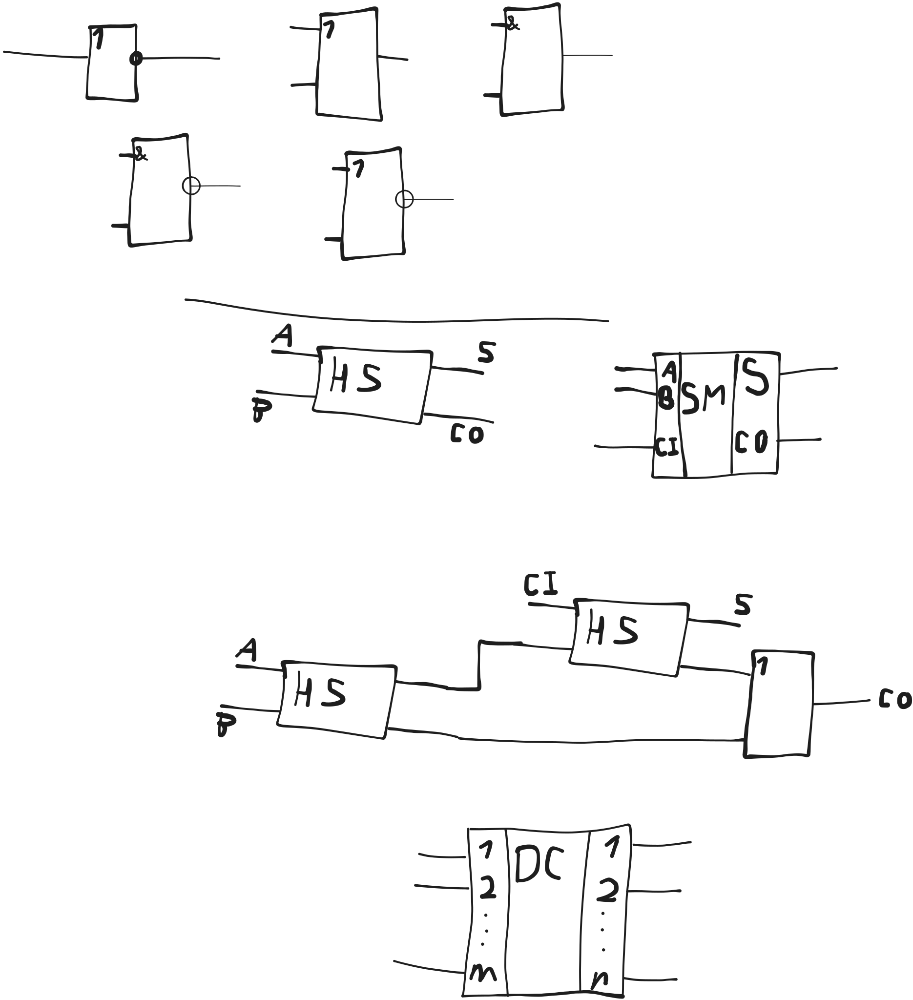
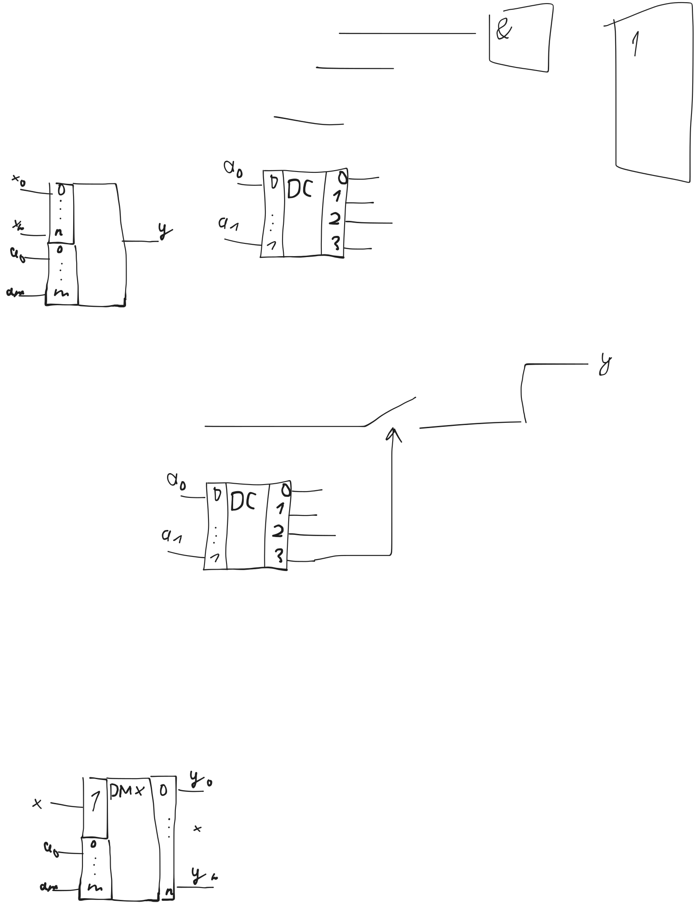
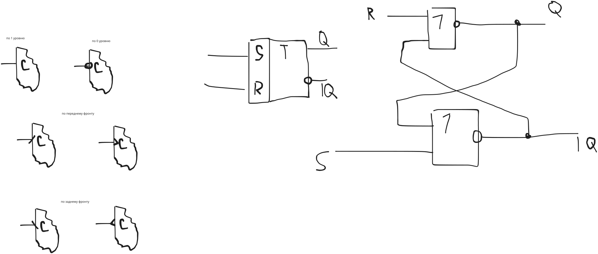

# Элементы и узлы ЭВМ

алгебра логики удобна для описания цифровых схем

Поскольку хорошо коррелирует с двоичной арифметикой

там истинность а тут биты

## Логические функции

Чтобы были различные интерпретации логических высказываний, используются _логические переменные_

Она соответствует 1 биту и простому высказыванию

Чтобы закодировать _сложное_ высказывание, используются _логические функции_

Каждая включает в себя несколько логических переменных (n штук),
которые связаны между собой операциями алгебры логики.

Логическая функция, как и переменная, принимает только 2 значения: 0 или 1.

В зависимости от значений переменных

С точки зрения цифровой схемотехники:
- Входы - значения переменных
- Выход - значение функции

выражаются через _элементарные функции_ одной или двух переменных

- отрицание
- конъюнкция
- дизъюнкция
- некоторые другие

кон. и диз. расширяются на 2+ переменных

из них можно сделать любую сложную функцию

функция может задаваться формулой или таблицей истинности

## Переход от таблицы истинности к формуле

Вспомогательная логическая функция - __терм__ ($F_i$)

Может существовать только для тех значений входных переменных,
для которых исходная фция равна 1

Терм это конъюнкция переменных в прямом или инверсном виде
- Без инверсии, если значение в строке терма = 1
- С инверсией, если значение в строке = 0

$F_5 = x_1 \land \overline x_2 \land x_3$

В общем случае _аналитическое представление_ функции совпадает с дизъюнкцией всех термов

СДНФ!

это максимально возможная записи функции

Перед построением электронных схем логическая функция обязательно минимизируется

Как можно меньше переменных (входных сигналов) и логических операций

Для этого можно:
- просто преобразовать законами алгебры логики
  - напр. логические тождества
  - логические законы

де морган понадобится для подгонки под базис

## Элементы и типовые узлы компьютера

Современный компьютер это сложная электронная система,
которая состоит из огромного количества электронных компонентов:
- транзисторы
- диоды
- резисторы
- конденсаторы

Многие из них группируются в интегральные схемы

Важная особенность структуры - ее _регулярность_:
1. Копмьютер состоит из большого количества простейших элементов всего нескольких типов
2. Элементы образуют сравнительно небольшое количество типовых схем

несмотря на сложность системы, по типу таких элементов немного

они образуют типовые схемы для построения более сложных устройств

По степени сложности:
- Элементы
  - Простейшая логическая часть компьютера
  - Оперирует только одним видом информации
  - Виды:
    - Цифровые
      - Работают только с сигналами принимающими 2 значения (1/0)
      - Могут изменятся только в строго определенные дискретные моменты времени,
        - задаваемые тактами
    - Аналоговые
      - Оперируют произвольными сигналами
      - Выполняют скорее вспомогательную функцию
  - По функциональному назначению:
    - Логические
      - Для обработки информации
      - Образуют узлы комбинационного типа
    - Запоминающие
      - Для хранения
      - Образуют узлы накапливающего типа
- Узлы
  - Могут обрабатывать несколько бит за раз
  - Комбинационные
    - Сумматоры
    - Дешифраторы
    - Мультиплексоры
    - ...
  - Накапливающие
    - Регистры
    - Счетчики
- Устройства
  - Состоят из нескольких узлов
  - Выполняют одно или несколько однотипных операций над машинными словами
  - Например
    - АЛУ
    - УУ
    - Память
  - Могут быть несколько в одном корпусе (напр. проц)

## Логические элементы и узлы комбинационного типа

Основные логические элементы реализуют элементарные логические функции

- Инвертор
  - НЕ
- Дизъюнктор
  - ИЛИ
- Конъюнктор
  - И

(обозначения по госту)

Помимо этих элементов часто на практике используются универсального базиса:
- Штрих Шеффера
  - И-НЕ
- Стрелка Пирса
  - ИЛИ-НЕ

### Пример построения комбинационной схемы

F = (A OR B) AND NOT (C AND A OR B)

> требования к задаче:
> - не должны дублироваться входы
>   - нужно сделать ветвление (в виде точки)
> - не должны входы под отрицанием
> - входы строго слева
> - выходы строго справа
> - обозначения все по госту

### Узлы комбинационнго типа

Строятся на основе логических элементов

- сумматор
- дешифратор
- шифратор
- мультиплексор
- демультиплексор

#### Сумматор

Двоичный комбинационный сумматор - это узел,
выполняющий сложение двух чисел,
представленных в виде двоичных кодов

Является центральным узлом любого АЛУ процессора

Выполняет поразрядное сложение двоичных чисел,
начиная с младшего разряда,
формируя значение суммы и перенос в старший разряд

Для реализации этого алгоритма, при сложении каждого разряда
используется одноразрядные сумматоры,
который при помощи соединения цепей переноса образуют многоразрядные.

Рассмотрим процесс построения сумматора на базе **полу**сумматора.

#### Полусумматор

Это узел, который имеет 2 входа и 2 выхода

На входы: разряды слагаемых

На выходы: значение суммы (S) и перенос в старший разряд (CO)

S = not A B or A not B = A xor B

CO = A B

желательно схему "отследить" перед сдачей

В отличие от ПОЛУсумматора,
обычному сумматору необходимо учитывать значение переноса из младшего разряда,
поэтому у него есть еще один вход

#### Дешифратор

Это узел с $m$ входами и $n$ выходами.

Если $n=2^m$, такой дешифратор называют _полным_.

Дешифратор позволяет преобразовать двоичное число в _унитарный код_.

Это двоичное число, в котором только 1 единица.

<!-- SELECT -->

Иными словами: активирует __только одну__ выходную линию в зависимости от числа на входе.

На вход обычно подается номер активируемой линии

Широко используются в цифровой схемотехнике

Например для:
- Расшифровки кодов операций
- Декодирования адресов ячеек памяти
- Формирования управляющих сигналов

строится из СДНФ. каждая СДНФ состоит из 1 терма

#### Шифратор

Его значение противоположно **де**шифратору

Унитарный -> в позиционное двоичное число.

Также имеет $m$ входов и $n$ выходов.

Если $m=2^n$, такой шифратор называют _полным_.

Чаще всего используется для генерирования адреса активного устройства.

Обозначается как и дешифратор, но буквы CD (вместо DC)

#### Мультиплексор

Это комбинационная схема с 2 группами входов:
- Информационные (0..<n)
- Адресные (0..<m)

> $n = 2^m$

И всего один выход

Назначение: позволяет соединить одну из входных информационных линий
с выходом.

Номер соединяемого входа определяется двоичным кодом на адресных входах

Применяются в:
- Коммутирующих устройствах
  - Для распределения потоков информации

Мультиплексоры бывают:
- Цифровые
  - Только логические элементы в составе
  - Могут коммутировать только цифровые сигналы
- Аналоговые
  - Дополнительно имеются силовые ключи
    - Позволяют коммутировать любые сигналы

В любых мультиплексорах могут использоваться дешифраторы (в качестве коммутирующих устройств)

#### Демультиплексор

Это обратная схема для мультиплексора

Соединяет 1 информационный вход с одним из выходов, в зависимости от значения адресного входа.

### Запоминающие элементы

Служат для хранения информации.

Элемент (обычно) может хранить только 1 бит.

Есть множество способов аппаратной реализации запоминающих элементов.

- Статические
  - Хранят информацию сколь угодно долго, но пока подано питание
  - Энергозависимы
  - Используются триггеры (_заглушки_) различных типов типов
  - Триггер - это электронная схема, имеющая 2 устойчивых состояния,
    - Которые можно менять при помощи входных сигналов
    - Кол-во входов: зависит от типа
    - Кол-во выходов: всегда 2
      - Прямой ($Q$)
      - Инверсный ($\overline Q$)
      - Всегда различны
      - Состояние триггера всегда определяется сигналом на его прямом выходе
    - Бывают:
      - Синхронные
        - Есть дополнительный вход синхронизации (C)
        - Он может запрещать или разрешать изменение состояния
        - Это нужно чтобы группы триггеров срабатывали одновременно
      - Асинхронные
        - Изменяют состояние, как только на их входы поступают сигналы
- Динамические
  - Хранят информацию недолго <!-- в течение небольшого промежутка времени -->
  - Для построения могут использоваться конденсаторы
    - (их можно зарядить)
    - Требуются дополнительные схемы для постоянной подзарядки
    - Зато дешевый и простой в изготовлении

#### Типы синхронизации триггеров

- По единичному уровню
  - По единице изменение разрешено
  - По нулю - запрещено
- По нулевому уровню
  - Наоборот
- По переднему фронту
  - Воспринимается при 0 -> 1
- По заднему фронту
  - Воспринимается при 1 -> 0

#### Типы триггеров

На практике чаще всего:
- RS
  - S - set, для записи единицы
  - R - reset, для записи нуля
- JK
- D
- T
- Шмидта
- ...

Буквенными обозначениями определяются входы триггеров

Для описания логики работы триггеров используются _таблицы переходов_

Q(t+1) - новое состояние

Q(t) - предыдущее

##### Асинхронный RS-триггер

|R|S|Q(t+1)|
|-|-|-|
|0|0|Q(t)|
|0|1|1|
|1|0|0|
|1|1|undefined behavior|

можно построить из И-НЕ или через ИЛИ-НЕ

##### Синхронный RS-триггер

У него дополнительно есть вход синзронизации (C) <!-- или S? -->

Этот вход может разрешать или запрещать изменение состояние триггера

Рассмотрим пример когда 1 - разрешающий сигнал.

Все остальные участки синх. сигнала - запрещающие

в общем он меняет свое состояние только когда синхросигнал разрешающий

синхросигнал обычно исходит от процессора

##### Двухступенчатый RS-триггер

В цифровых системах часто возникает необходимость передачи информации по цепочке триггеров.

Например, при сдвиге (в сдвигающих регистрах)

При этом каждый триггер должен одновременно передавать старую информацию и воспринимать новую.

Если состояние триггера будет изменяться мгновенно, то есть риск потерять старую информацию.

Вот для этого и нужен двухступенчатый триггер

##### D-тригер

Обычно всегда синхронный

У него 1 основной вход D

На прямом выходе повторяет значение D

Этот сигнал может быть синхронизирован

(2ступенчатый выглядит так же)

##### T-триггер

Имеет 1 вход, может быть асинхронным

|T|Q(t+1)|
|-|------|
|0|Qt    |
|1| \| Qt|

Часто используется для подсчета сигналов

Мтроится на базе синхронного двухступенчатого RS-триггера

##### JK-триггер

отличается от RS тем, что две единицы дают инверсию текущего состояния
