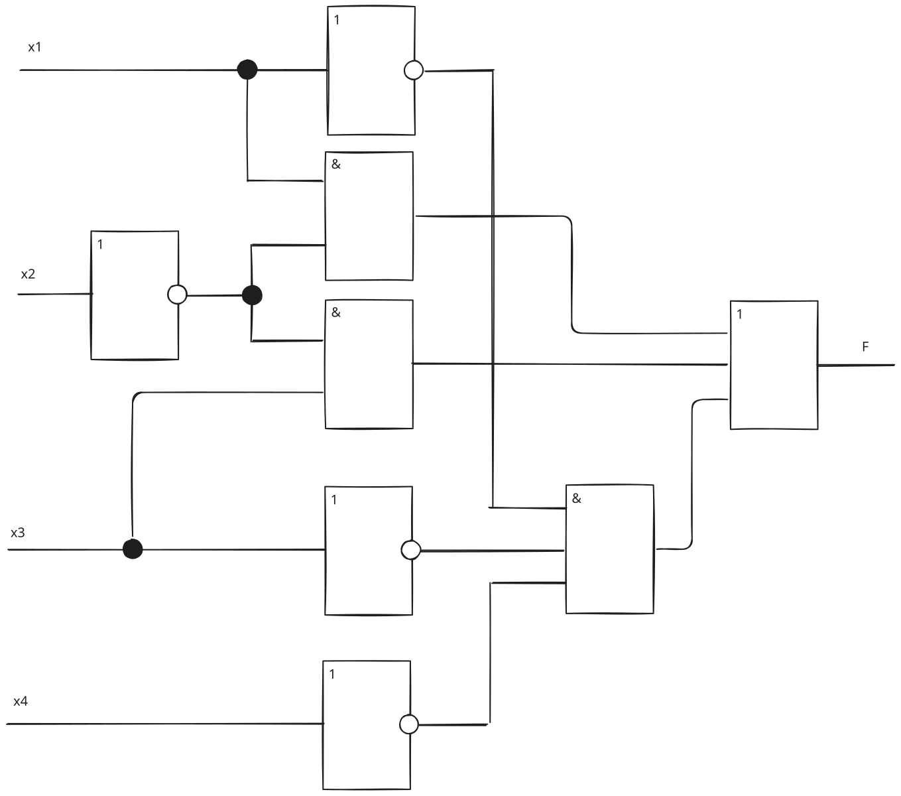
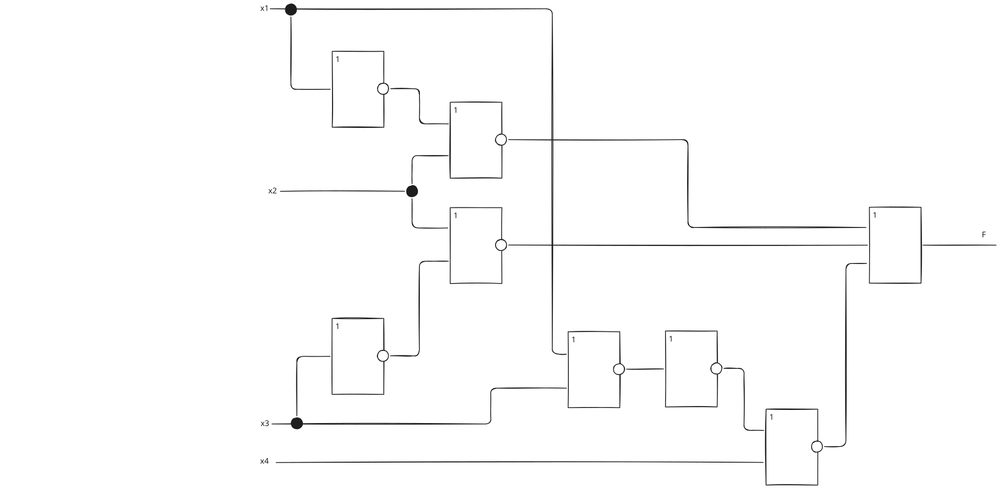
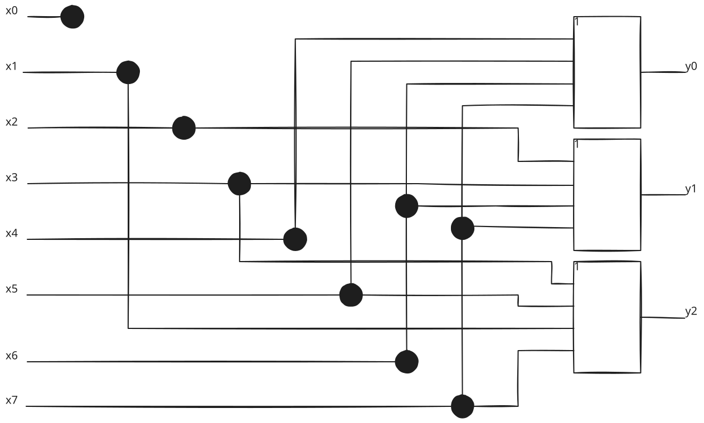
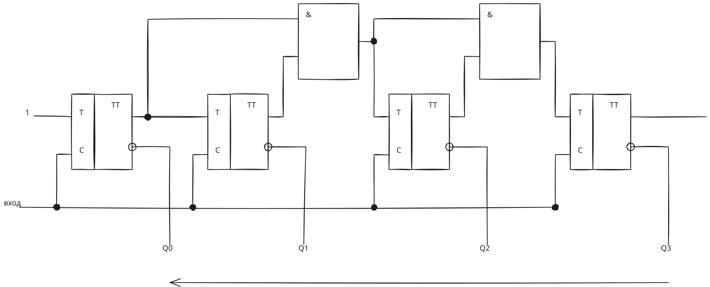
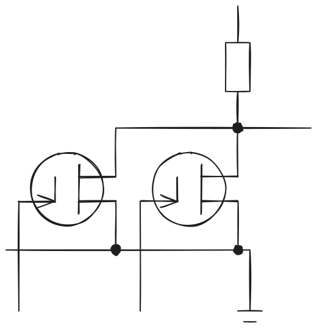

> Вариант 5

Задача 1
===

<!--$F = \Sigma (1011'1000'1111'0000)$-->

| N          | x_1 | x_2 | x_3 | x_4 | F |
|------------|-----|-----|-----|-----|---|
| __0__      | 0   | 0   | 0   | 0   | 1 |
| 1          | 0   | 0   | 0   | 1   | 0 |
| __2__      | 0   | 0   | 1   | 0   | 1 |
| __3__      | 0   | 0   | 1   | 1   | 1 |
| __4__      | 0   | 1   | 0   | 0   | 1 |
| 5          | 0   | 1   | 0   | 1   | 0 |
| 6          | 0   | 1   | 1   | 0   | 0 |
| 7          | 0   | 1   | 1   | 1   | 0 |
| __8__      | 1   | 0   | 0   | 0   | 1 |
| __9__      | 1   | 0   | 0   | 1   | 1 |
| __10 (A)__ | 1   | 0   | 1   | 0   | 1 |
| __11 (B)__ | 1   | 0   | 1   | 1   | 1 |
| 12 (C)     | 1   | 1   | 0   | 0   | 0 |
| 13 (D)     | 1   | 1   | 0   | 1   | 0 |
| 14 (E)     | 1   | 1   | 1   | 0   | 0 |
| 15 (F)     | 1   | 1   | 1   | 1   | 0 |

$F = \Sigma (0; 2; 3; 4; 8; 9; 10; 11)$

```c
bool F = (
    !x1 && !x2 && !x3 && !x4 ||  // 0
    !x1 && !x2 &&  x3 && !x4 ||  // 2
    !x1 && !x2 &&  x3 &&  x4 ||  // 3
    !x1 &&  x2 && !x3 && !x4 ||  // 4
     x1 && !x2 && !x3 && !x4 ||  // 8
     x1 && !x2 && !x3 &&  x4 ||  // 9
     x1 && !x2 &&  x3 && !x4 ||  // 10
     x1 && !x2 &&  x3 &&  x4     // 11
);
```

- 0: v 0000
- 1: v 0010; v 0100; v 1000
- 2: v 0011; v 1001; v 1010
- 3: v 1011

---

- 0-1: v 00_0; 0_00; _000
- 1-2: v 001_; v _010; v 100_; v 10_0
- 2-3: v _011; v 10_1; v 101_

- 0-1-2: _0_0
- 1-2-3: _01_; _01_; 10__; 10__

---

`0_00` `_000` `_0_0` `_01_` `10__`

| implicant | 0000 | 0010 | 0011 | 0100 | 1000 | 1001 | 1010 | 1011 |
|-----------|------|------|------|------|------|------|------|------|
| `0_00`+   | O    |      |      | O    |      |      |      |      |
| `_000`-   | O    |      |      |      | O    |      |      |      |
| `_0_0`-   | O    | O    |      |      | O    |      | O    |      |
| `_01_`+   |      | O    | O    |      |      |      | O    | O    |
| `10__`+   |      |      |      |      | O    | O    | O    | O    |

```haskell
F :: Bool -> Bool -> Bool -> Bool -> Bool
F x1 x2 x3 x4 =
    not x1 && not x3 && not x4 ||
    not x2 &&     x3 ||
        x1 && not x2
```



```hs
a \|/ b = not (a || b)

a \|/ b = not a && not b

a && b = not a \|/ not b

F x1 x2 x3 x4 =
    not (x1 \|/ x3) \|/ x4 ||
    x2 \|/ not x3 ||
    not x1 \|/ x2
```

not ((not not x1) \|/ (not not x3)) \|/ x4



Задача 2
===

| x | y0,y1,y2 |
|---|----------|
| 0 | 000      |
| 1 | 001      |
| 2 | 010      |
| 3 | 011      |
| 4 | 100      |
| 5 | 101      |
| 6 | 110      |
| 7 | 111      |

```
y0 = x4 || x5 || x6 || x7

y1 = x2 || x3 || x6 || x7

y2 = x1 || x3 || x5 || x7
```





$F(A, B) = \overline A \land \overline B$

по закону де Моргана:

$F(A, B) = \overline{A \lor B} = A \downarrow B$

