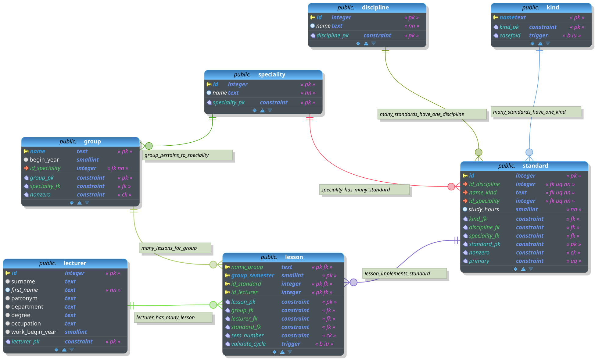

лабораторные работы по базам данных

- [workload.dbm](workload.dbm) проект в pgModeler (лаб1,3,5)
- [insert.sql](insert.sql) тестовые данные
- [select.sql](select.sql) запросы (лаб2)
- [trigger_test.sql](trigger_test.sql) проверка триггеров (лаб5) _TODO_: протестировать декларативные ограничения?
- [select_complex.sql](select_complex.sql) сложные запросы + представления (`VIEW`, лаб4) _TODO_
