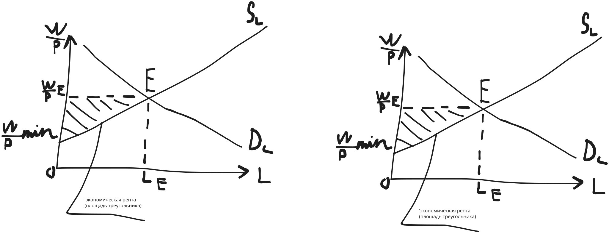

# Рынки факторов производства

1. Сущность труда, характеристика рынка труда
2. Капитал как фактор производства, рынок капитал
3. Земля как фактор производства, рынок земли

Труд - это целесообразная деятельность людей,
направленная на создание материальных и культурных ценностей.

Рынок труда - это система экономических отношений
по поводу купли-продажи специфического товара - рабочей силы.

Спрос на труд - это кол-во труда, которое работодатель желает и может
купить по рыночной цене труда в данный период и прочих равных условиях.

Субъектами спроса на рынке труда являются предприятия,
а субъектами предложения - домашние хозяйства.

Спрос на труд зависит от
- Реальной заработной платы
  - $W/P$
- Стоимости предельного продукта труда в денежном выражении
  - $MP_L$

Предложение труда проявляется в желании и способности индивида работать
определенное кол-во времени за заработную плату, установленную рынком труда.

#### Эффект замещения

По мере роста заработной платы,
работник заинтересован трудиться некоторое дополнительное время,
поскольку оно лучше оплачивается.

Каждый час свободного времени воспринимается работником как потеря денег.

Отсюда формируется склонность заменить досуг работой.

Эффект замещения проявляется до точки $I$.

Эффект дохода проявляется при достижении работником
достаточно высокого уровня материального обеспечения.

С увеличением рабочего времени,
час досуга становится для работника все более дорогим.

Тем более, у него есть средства, чтобы разнообразить отдых.

У работника формируется потребность в отдыхе.

Профсоюз - это объединение работников, обладающее
правом на ведение переговоров с предпринимателем
от имени и по поручению его членов.

Цели профсоюза:
- Максимизация заработной платы его членов;
- Улучшение условий их работы;
- Получение дополнительных выплат и льгот.

<!-- Создаются дополни -->

Заработная плата - это цена, выплачиваемая
за использование труда наёмного работника.

Формы:
- Номинальная
  - Сумма денег, полученная наемным работником.
  - По ее величине судят об уровне заработка, дохода.
    - Но не об уровне потребления и благосостояния чебуреков
  - Для определения нужно знать, какова реальная заработная плата.
- Реальная
  - СОВОК товаров и услуг,
  - которые можно приобрести на эти деньги
  - с учетом их покупательной способности.

Экономическая рента - это регулярно получаемый,
но не связанный с предпринимательской деятельностью доход.

Это плата за ресурс, предложение которого строго ограничено.

## Капитал

Это любой ресурс, создаваемый с целью
производства большего кол-ва экономических благ.

Это фактор производства, представленный всеми средствами производства,
которые созданы людьми для того,
чтобы с их помощью производить другие товары и услуги.

К нему относятся:
- Инструменты
- Оборудование
- Здания
- Сооружения
- Сырьё
- ...

<!-- меркантилисты - все субьекты хотят накопление денег -->

<!-- физиократы -->

Капитал - это ресурс для производства экономических благ.

<!-- Классификации -->

2 Основные формы капитала:
- Физический (материально-вещественный). Разделяется на:
  - Основной
    - Активы длительного пользования
      - Здания
      - Сооружения
      - Машины
      - Оборудование
    - Служит в течение нескольких лет
    - Подлежит замене только по мере его физического или морального износа
    - Физический износ
      - Происходит в процессе производства и под воздействием сил природы
    - Моральный износ
      - Снижение свойств основного капитала, связанное с:
        - Техническим прогрессом
        - Переменой образа жизни
        - Воздействием моды
        - ...
    - Каждый собственник основного капитала списывает определенную часть стоимости его оборудования
      - Осуществляет _амортизационные отчисления_
  - Оборотный
    - Расходуется на покупу средств для каждого цикла производства:
      - Сырья
      - Основных и вспомогательных материалов труда
    - Полностью потребляется в течение 1 цикла производства
    - Его стоимость включается в издержки производства целиком
      - В отличие от основного капитала,
      - стоимость которого учитывается в издержках по частям.
- Чебуреческий
  - знания
  - навыки
  - производственный опыт
  - ...