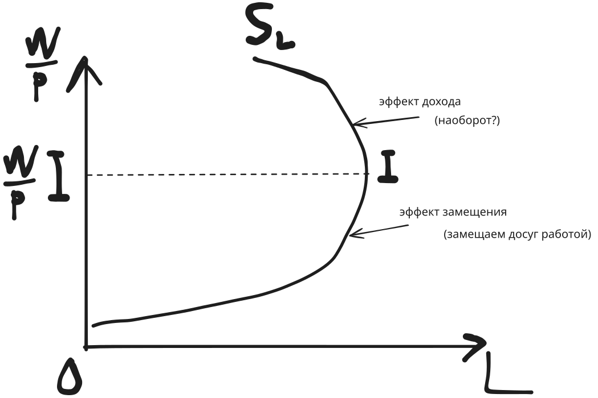

# Рынки факторов производства

1. Сущность труда, характеристика рынка труда
2. Капитал как фактор производства, рынок капитал
3. Земля как фактор производства, рынок земли

Труд - это целесообразная деятельность людей,
направленная на создание материальных и культурных ценностей.

Рынок труда - это система экономических отношений
по поводу купли-продажи специфического товара - рабочей силы.

Спрос на труд - это кол-во труда, которое работодатель желает и может
купить по рыночной цене труда в данный период и прочих равных условиях.

Субъектами спроса на рынке труда являются предприятия,
а субъектами предложения - домашние хозяйства.

Спрос на труд зависит от
- Реальной заработной платы
  - $W/P$
- Стоимости предельного продукта труда в денежном выражении
  - $MP_L$

Предложение труда проявляется в желании и способности индивида работать
определенное кол-во времени за заработную плату, установленную рынком труда.

#### Эффект замещения

По мере роста заработной платы,
работник заинтересован трудиться некоторое дополнительное время,
поскольку оно лучше оплачивается.

Каждый час свободного времени воспринимается работником как потеря денег.

Отсюда формируется склонность заменить досуг работой.

Эффект замещения проявляется до точки $I$.

Эффект дохода проявляется при достижении работником
достаточно высокого уровня материального обеспечения.

С увеличением рабочего времени,
час досуга становится для работника все более дорогим.

Тем более, у него есть средства, чтобы разнообразить отдых.

У работника формируется потребность в отдыхе.