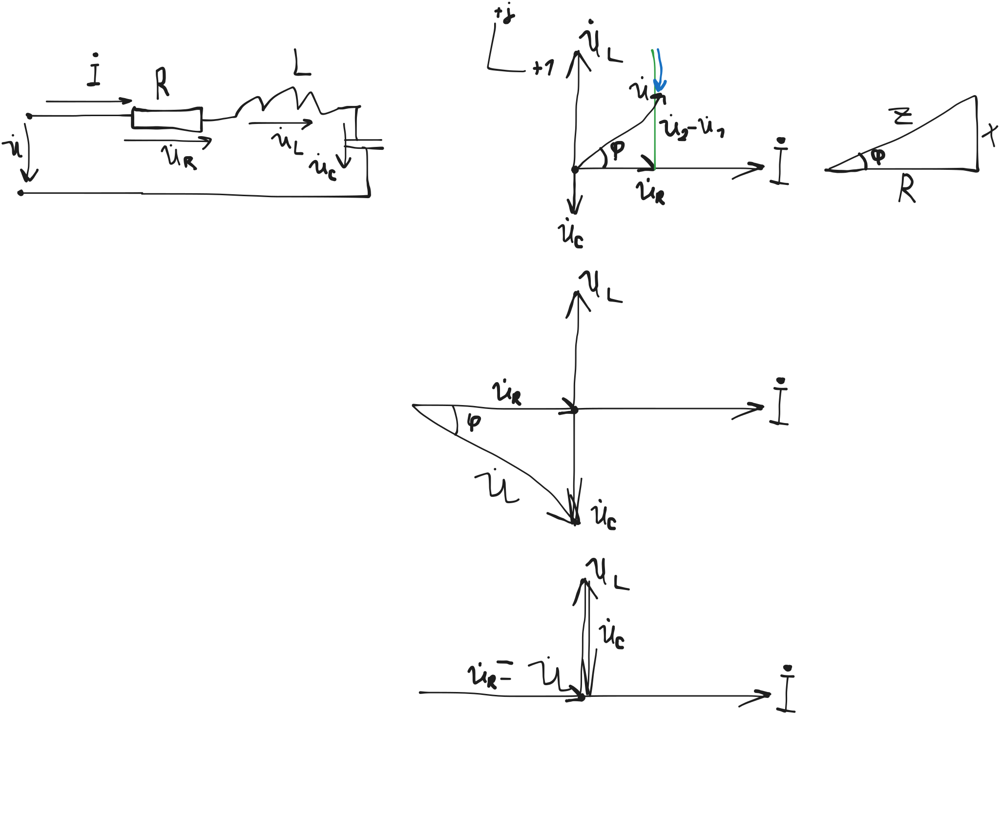
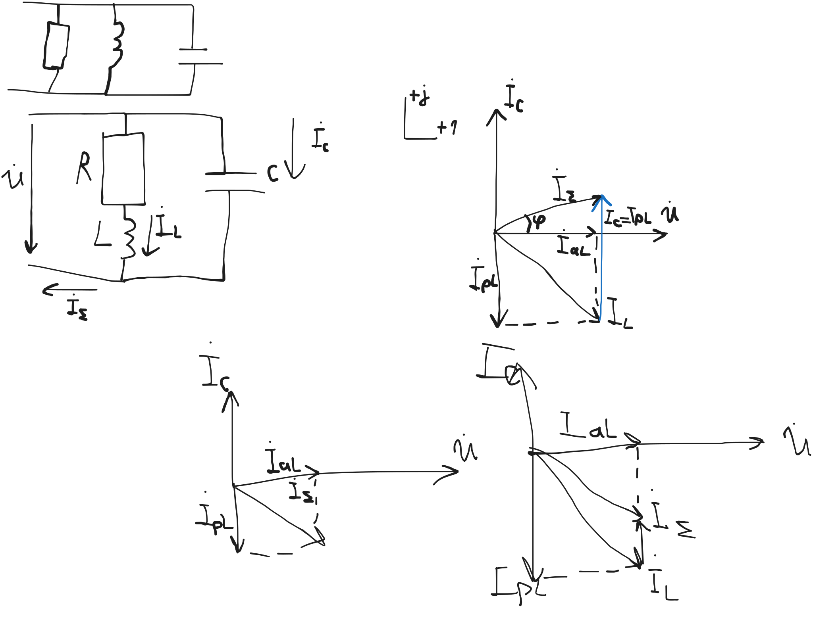

# Электрические цепи переменного тока

Переменным называется электрический ток,
величина которого или (и) направление может изменяться со временем

Переменный электрический ток может быть:
- Периодическим
  - Содержит сигнал, который повторяется с течением времени
- Апериодическим
  - Изменяется во времени случайным образом
  - Либо по апериодическому закону

В промышленности наиболее часто применяют электрический ток,
изменяющийся по закону синуса

i(t) = I_m sin(omega t + phi _i)

Синусоидальный электрический ток будет характеризоваться величинами:
- Мгновенное значение (i)
- Амплитудное значение (I_m)
- Действующее значение (I)
  - интрегальный показатель
  - для синуса:
  - I = I_m / sqrt(2)
  - в ризетке: -310..+310
- Угловая частота (omega; рад/с)
  - omega = 2 pi f рад/с
  - f = 1 / T, Гц
  - 50 Гц! не 60! мы не инагенты!
  - 0.02 изменения в секунду
- Угол phi_i - начальная фаза

i_1(t) = I_m sin(omega t + phi _(i1))

i_2(t) = I_m sin(omega t + phi _(i2))

Для упрощения вычислений, переменный синусоидальный ток
представляется в виде вращающегося радиус-вектора

Данным способом возможно определение суммы и разности векторов.

Чтобы выполнять остальные действия, вращающийся радиус-вектор помещаем в комплексную плоскость,
т.е. представляем его в виде комплексного числа,
одновременно произведя масштабирование до действующих значений

Комплексным называется число, состоящее из действительной и мнимой части.

Формы:
- Арифметическая:
  - underline(A) = x + jY
- Показательная
  - A * e ^ (j phi_A)

A * e ^ (j phi) = A cos phi_A + jA sin phi_A

A = sqrt(x^2 + y^2)

phi_A = arctg (y/x)

underline(B) = M + jN

underline(A) + underline(B) = (X + M) + j(Y + N)

underline(A) - underline(B) = (X - M) + j(Y - N)

underline(A) * underline(B) = A * B * e^(phi_A + phi_B)

underline(A) / underline(B) = A / B * e^(phi_A - phi_B)

> можно калькуляторы!

# Поведение резистивного элемента в цепи синусоидального тока

i(t) = I_m sin omega t

тогда на сопротивлении возникает падение напряжения

U(t) = R * i(t) = RI_m sin omega t

U(t) = U_m sin omega t

Представим синусоидальные величины в векторном виде; т.е.
Построим вектроную диаграмму

m_i: 1 cm = 0.2 А

Найдем мгновенную мощность

p(t) = U(t) * i(t) = U_m sin omega t * I_m sin omega t

p(t) = U_m  I_m * 1/2 ( 1 - cos 2 omega t )

1/2 = 1/(sqrt(2) * sqrt(2))

p(t) = UI = UI cos 2 omega t

Построим временные диаграммы

Выводы:
- из векторной диаграммы видно,
  - что угол между током и напряжением на резистивном элементе равен нулю,
    - т.е. они совпадают по фазе
- мгновенная мощность резистивного элемента состоит из
  - постоянной составляющей (U * I)
  - и переменной
    - -U * I cos omega t
  - причем средняя мощность за период равна 
- мгновенная мощность всегда положительна,
  - а значит на резистивном элементе выполняются необратимые преобразования
    - в тепло и другие виды энергии
  - такая мощность называется активным
    - а сам резистор - активным сопротивлением

# Индуктивный элемент в цепи переменного тока

Пусть через индуктивность протекает синусоидальный ток

Тогда напряжение на индуктивности определяется по закону электромагнитной индукции

U(t) = L di/dt = L I_m d(sin omega t) / dt = omega l I_m cos omega t

Обозначим omega l как индуктивное сопротивление X_l, Ом

U_l(t) = U_m sin(omega t + pi/2)

Построим векторную диаграмму, найдем мгновенную мощность

p(t) = U * i = U_m cos omega t * I_m sin omega t = U_m * I_m 1/2 sin 2 omega t

p(t) = UI * sin 2 omega t

Выводы:
- угол между током и напряжением индуктивного элемента равен +90 градусов
  - при этом ток отстает от напряжения
- мгновенная мощность индуктивного элемента состоит только из переменной составляющей
  - UI * sin 2 omega t
  - при этом среднее ее значение за период равно нулю
- существуют периоды времени когда мощность:
  - положительна (потребляется)
  - отрицательно (отдается в сеть назад)
  - то есть эта мощность обмена, которая расходуется на создание магнитного поля индуктивностью
    - такая мощность называется реактивной
    - а сам элемент называется _реактивным сопротивлением_

## Емкость в цепи переменного тока

Пусть через конденсатор протекает синусоидальный ток

Ток и напряжение конденсатора связаны следующим выражением:

i = C (dU)/(dt)

U(t) = 1/C integral i(t) dt

U(t) = 1/(omega C) I_m (-cos omega t)

X_C = 1/(omega C)  // емкостное сопротивление

U_C(t) = U_m sin(omega t - pi/2)

p(t) = U_C * i = -UI * sin 2 omega t

Выводы:
- угол между током и напряжением емкости составляет -90 градусов
  - при этом напряжение отстает от тока
- мощность емкости также является реактивной
  - поскольку состоит только из переменной составляющей
- мощность емкости изменяется в проитвофазе с мощностью индуктивности
  - то есть они могут обмениваться энергией

# Резонанс напряжения

Рассмотрим последовательное включение активного индуктивного и емкостного элемента

В случае включения их на переменное синусоидальное напряжение,
в цепи возникнет переменный синусоидальный ток,
вызывая на элементах падение напряжения.

По 2 закону Кирхгофа:

$$\dot U = \dot U_R + \dot U _L + \dot U _C$$

Построим векторную диаграмму

В результате был получен прямоугольный треугольник напряжения
с катетами $U_R$, $U_L - U_C$
и гипотенузой $U$.

Поделим все стороны этого треугольника на величину силы тока

Получаем _подобный_ треугольник сопротивлений

$$\underline Z = R + j X_L - j X_C$$

$$\underline Z = R + j (X_L - X_C)$$

Исходя из соотношений X_L и X_C, можно выделить три случая:
- $X_L > X_C$
  - В этом случае считается, что угол положительный
  - А в цепи возникает активно-индуктивный характер
  - $\varphi > 0$
- $X_L < X_C$
  - В этом случае угол отрицателен
  - $\varphi < 0$
  - И цепь имеет активно-емкостный характер
- $X_L = X_C$
  - В цепи возникает чисто активный характер
  - В этом случае угол равен нулю
  - $\varphi = 0$
  - Это называется режимом __резонанса напряжения__

кароче увеличиваем напряжение

---

U = 10 V

R = 10 Ohm

X_L = X_C = {10, 100, 1000} Ohm

-> I = 1 A

НТМИ: напряжения трансформатор маслянный измерительный

НАМИ: напряжения антиферрорезонансный масляный измерительный

Условием возникновения резонанса напряжений является выражение:

$$X_L = X_C$$

$$\omega L = 1 / (\omega C)$$

как сделать резонанс?

Для получения резонанса можно воспользоваться тремя способами:
- Изменение емкости (C)
  - лабораторка №2
- Изменением индуктивности (L)
- Изменением частоты ($\omega$)

$$\omega _{рез} = 1/\sqrt{LC}$$

При резонансе, индуктивность и емкость обмениваются энергией,
что приводит к возникновению устойчивых колебаний.

Поэтому такую цепь при резонансе называют __колебательным контуром__.

Он характеризуется _величиной добротности_:

$$Q = U_L / U = U_C / U$$

# Параллельная цепь переменного тока. Резонанс тока.

$$\dot I _\Sigma = \dot I _L + \dot I _C$$

В данном случае необходимо рассматривать реактивные проводимости

$$\underline \gamma_L = 1 / (\underline Z_L) = 1 /(R + j X_L) = g + j B_L$$

- g - активная составляющая
- b - реактивная составляющая

$$\underline \gamma_L = R / (R^2 + X_L ^2) + j X_L / (R^2 + X_L ^2)$$

$$b_L = - X_L / (R^2 + X_L ^2)$$

$$\underline \gamma_C = 1 / (\underline Z_C) = 1 / (-j 1/(\omega C))$$

В зависимости от соотношения b_L и b_C по величине можно получить три случая:
- $b_L < b_C$
  - $\varphi < 0$
- $b_L > b_C$
  - $\varphi > 0$
- $b_L = b_C$
  - $\varphi = 0$
  - __Резонанс тока__
  - ток в неразветвленной части цепи будет обусловлен только активным сопротивлением

При резонансе, ток в неразветвленной части будет минимальным

Условие возникнвения резонанса токов - равенство реактивных проводимостей:

$$(\omega L) / (R^2 + (\omega L)^2) = \omega C$$

Резонанс токов можно получить 4мя способами - изменяя
- R
- L
- C
- или $\omega$

# Мощность цепи переменного тока

Рассмотрим треугольник напряжений

Если умножим все стороны этого треугольника на величину силы тока,
то получим подобный треугольник мощностей

Где активному напряжению - активная мощность

Реактивному - реактивная

А полному - полная

## Активная мощность

это мощность, которая совершает работу

$P = UI cos \varphi$, Вт

$P = I^2 R$

Те. мощность необратимого преобразования

## Реактивная мощность

это мощность обмена между реактивными элементами.

$Q = UI \sin \varphi$, вар (вольт-амперы реактивные, ВАр)

$Q = I^2 \cdot X$

Она необходима для создания магнитного и электрического полей

а это для электродвигателей

те. мощность, за период равная 0

## Полная мощность

это комплексная мощность, включающая в себя
активную и реактивную мощности.

$S = UI$, ВА

$\dot S = P + jQ = \dot U \cdot I^*$

для цепей переменного тока важными показателями являются
- коэффицент мощности $\cos \varphi = P/S$
- коэффицент реактивной мощности $\tg \varphi = Q/P$

---

\Delta P = I^2 \cdot R_Л = (P^2 + Q^2) / U^2 \cdot R_Л

$\cos \varphi \geq 0.95$
