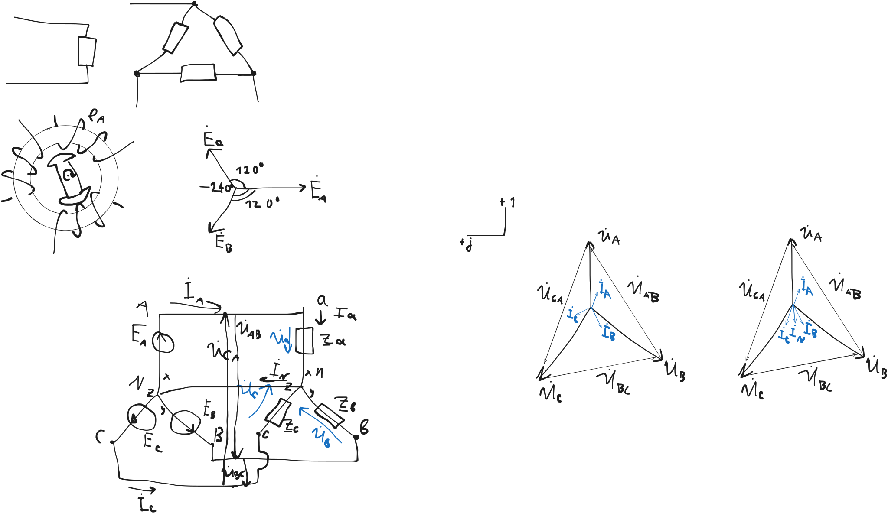

# Трёхфазные электрические цепи

Это электрическая цепь, состоящая из трех однофазных систем,
соединенных определенным образом.

При этом ЭДС этих трех однофазных систем образует симметричную
векторную диаграмму, в которой ЭДС сдвинута на 120 градусов

Трехфазная система напряжений получается в трехфазном генераторе

В таких трехфазных генераторах при равномерном вращении получается
синусоидальная ЭДС

$$e_A (t) = E_m \sin \omega t$$

$$e_B (t) = E_m \sin (\omega t - 120 \degree)$$

$$e_C (t) = E_m \sin (\omega t - 240 \degree)$$

$$e_C (t) = E_m \sin (\omega t + 120 \degree)$$

Для получения 3-фазной системы из этих трех ЭДС,
обмотки генератора соединяются звездой либо треугольником.

Аналогичным образом соединяются фазы нагрузки.

## Соединение нагрузки 3-фазной системы звездой

Обозначим начало фаз источника питания буквами: A B C

Концы фаз: X Y Z

Для нагрузки: a b c x y z

Для получения соединиения "звезда",
концы обмоток генератора соединяются в единую точку.

Аналогичным образом соединяются концы обмоток нагрузки

Одноименные выводы генератора и нагрузки соединяются линейными проводами.

Места соединения концов фаз и нагрузки называются нулевыми точками.

Они могут быть объединены с помощью 0-го проводника.

В случае отсутствия 0-го проводника система называется 3-проводной.

При наличии - 4-проводной.

Ток, протекающий в линейном проводнике, называется линейным.

Ток, протекающий в фазе нагрузки, называется фазным.

Очевидно (кому?) что при соединении звездой фазные и линейные токи между собой равны

- $\dot I_A = \dot I_a$
- $\dot I_B = \dot I_b$
- $\dot I_C = \dot I_c$

Ток, протекающий в 0-м проводнике называется нулем

$\dot I_N = \dot I_a + \dot I_b + \dot I_c$

Напряжение, возникающее на фазе нагрузки, называется фазным.

Напряжение между двумя линейными проводниками называется линейным (междуфазным)

Зная напряжения фаз и их сопротивления, можно определить фазные токи.

- $\dot I_a = \dot U_a / \underline Z_a$
- $\dot I_b = \dot U_b / \underline Z_b$
- $\dot I_c = \dot U_c / \underline Z_c$

В случае, если сопротивления фаз равны как по величине, так и по характеру,
то фазные токи представляют из себя симметричную систему.

В этом случае нагрузка называется симметричной.

$$\underline Z_a = \underline Z_b = \underline Z_c$$

Построим векторную диаграмму токов и напряжений для трехфазной симметричной системы.

Построим векторную диаграмму несимметричной нагрузки.

### Сказка

солнечный день перед НГ 31 дек

на площадке на этаже с 3 квартирами (на рисунке)

- I_A - бабушка с дедушкой
- I_B - студент с курсачом (срочно) - только лампочка включена
- I_C - группа студентов на сьемной квартире (гуляют)

В соседнем подъезде пропал свет.

Звоним электрику.

Отвинтил случайно 0й проводник

0й ток = 0

вышла асимметрия напряжений

лампочка лопнула у студента

мораль: не пускайте пьяных электриков.

Назначение нулевого проводника
- выравнивание фазных напряжений в случае несимметричной нагрузки

## Соединение нагрузки треугольником

$$U_ф = U_л / \sqrt 3$$

При соединении треугольником, конец одной фазы нагрузки
соединяется с началом другой.

А общие точки подключаются к линейным проводам.

При соединении треугольником,
очевидно (кому?) что линейные напряжения также являются фазными.

При этом фазные токи определяются следующим образом:

- $\dot I_{ab} = \dot U_{ab} / \underline Z_{ab}$
- $\dot I_{bc} = \dot U_{bc} / \underline Z_{bc}$
- $\dot I_{ca} = \dot U_{ca} / \underline Z_{ca}$

Линейные токи

По 1 закону Кирхгофа:

- $\dot I_A = \dot I_{ab} - \dot I_{ca}$
- $\dot I_B = \dot I_{bc} - \dot I_{ab}$
- $\dot I_C = \dot I_{ca} - \dot I_{bc}$

Построим векторную диаграмму

Для соединения треугольником в случае симметричной нагрузки линейный и фазный токи различаются в $\sqrt{3}$ раз

## Мощность 3фазной цепи

Поскольку 3фазная эл. цепь состоит из 3 однофазных,
то необходимо измерять мощность всех 3 фаз

- Звезда: $P_3 = P_A + P_B + P_C$
- Треугольник: $P_3 = P_{AB} + P_{BC} + P_{CA}$

В случае симметричной нагрузки, мощности всех 3 фаз между собой равны.

И мы можем записать:

$$P_3 = 3 P_\Phi = 3 \cdot U_\Phi I_\Phi \cdot \cos \varphi = \sqrt{3} \cdot U_л \cdot I_лa \cdot \cos \varphi$$

$$I_л = I_ф$$

$$U_ф = U_л / \sqrt{3}$$

$$I_л = \sqrt{3} I_ф$$

$$I_ф = I_л / \sqrt{3}$$

Для треугольника формула получается той же самой

Аналогично для реактивной мощности

$$Q_3 = \sqrt{3} U_л \cdot I_л \cdot \sin \varphi$$

$$S_3 = \sqrt{3} U_л \cdot I_л$$