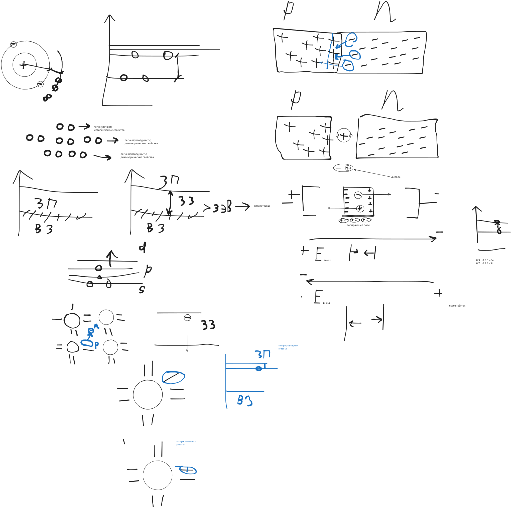

# Электроника



Полупроводники это вещества, занимающие промежуточное положение
между диэлектриками и проводниками.

У полупроводников ширина запрещенной зоны (ЗЗ)
гораздо меньше, чем у диэлектриков

Диэлектриками считаем вещества с шириной ЗЗ $\Delta W > 3 \, эВ$

У полупроводников: $\Delta W < 3 \, эВ$


у первых полупроводников:

$\Delta W = 0.72 \, эВ$

у кремния: $\Delta W = 1.11 \, эВ$

Основными полупроводниковыми веществами являются германий и кремний

Кремний образует кристаллическую решетку
путем попарного заполнения ячеек подуровней,
т.е. в ячейке присутствует свой электрон и электрон соседнего атома.

И таких ячеек у кремния 4

```
[ /|\  |  ]
[  |  \|/ ]
```

Таким образом, внешняя оболочка атома кремния оказывается полностью занята.

При нормальных условиях такой полупроводник обладает диэлектрическими свойствами,
т.е. не проводит электрический ток.

При увеличении энергии вещества, некоторые электроны могут покидать свое место,
переходя в зону проводимости и становясь _свободными электронами_

В валентной зоне возникает вакантное место, которое называется _дыркой_.

_Дырка_ считается положительным зарядом.

Если электрон теряет энергию, то он должен опускаться в запрещенную зону,
где существовать не может.

Поэтому высвобождает лишнюю энергию, опускается в валентную зону и занимает ближайшую дырку.

Этот процесс называется _рекомбинацией_.

Количество пар электрон-дырка в массиве полупроводника будет соответствовать
энергии этого куска полупроводника.

Если такой полупроводник включить в электрическую цепь,
то по нему будет протекать ток, обусловленный парами зарядов электрон-дырка.

В этом случае говорят о _собственной проводимости_ полупроводника.

`<!-- нам такое не нравится, потому что не можем управлять -->`

При добавлении в 4-валентный кремний 5-валентной примеси,
4 электрона примеси образуют связи с атомами кремния,
а 5-й становится свободным.

Количество таких электронов будет зависеть от концентрации примеси.

В результате получается полупроводник с преобладающей электронной проводимостью.

Т.е. __полупроводник n-типа__

При добавлении 3-валентной примеси 3 электрона связываются с атомами кремния,
а в кристаллической решетке появляется дырка.

Т.е. полупроводник обладает __дырочной проводимостью__ и называется __полупроводником p-типа__

т.н. тепловой пробой
