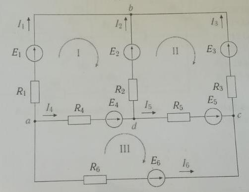
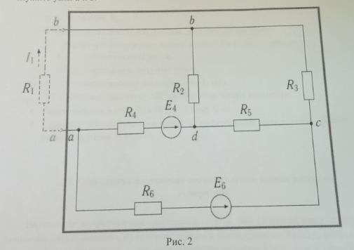
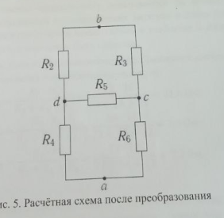
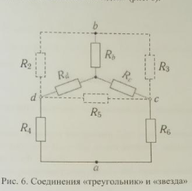
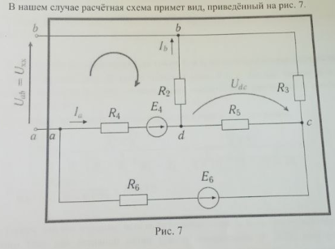
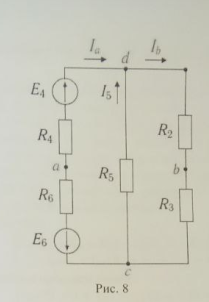
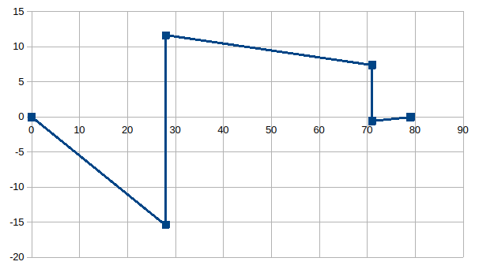

- R_1 = 17
- R_2 = 28
- R_3 = 43
- R_4 = 7
- R_5 = 38
- R_6 = 30


- E_2 = 27
- E_5 = 8



# 1 По законам кирхгофа

Ветви:
1. ab (R1)
2. db (R2, E2)
3. bc (R3)
4. ad (R4)
5. dc (R5, E5)
6. ac (R6)

6 токов, 6 уравнений, 6 неизвестных

4 узла: a, b, c, d

по 1 закону: 4-1=3 уравнения

по 2 закону: 6-3=3 уравнения

пусть d - нулевой потенциал

> 1 закон: алгебраическая сумма токов в узле равна нулю

- a: -I1 -I4 -I6 = 0
- b: +I1 +I2 +I3 = 0
- c: -I3 +I5 +I6 = 0

контуры:
- abda (R1, E2, R2, R4)
- dbcd (R2, E2, R3, E5, R5)
- adca (R4, R5, E5, R6)

> 2 закон: алгебраическая сумма напряжений (U)
> на элементах контура (_в нашем случае: резисторы_)
> равна алгебраической сумме ЭДС

- $+I_1 R_1 -I_2 R_2 -I_4 R_4 = -E2$
- $+I_2 R_2 -I_3 R_3 -I_5 R_5 = +E2 -E5$
- $+I_4 R_4 +I_5 R_5 -I_6 R_6 = +E5$

получили 6 уравнений

```
-1   0   0 -1   0  -1 | 0
+1  +1  +1  0   0   0 | 0
 0   0  -1  0  +1  +1 | 0
17 -28   0 -7   0   0 | -27
 0 +28 -43  0 -38   0 | +27 -8
 0   0   0 +7 +38 -30 | +8
```

- $I_1 = -122167/270975 \, А\approx −0,450842329 \, А$
- $I_2 = +9922/18065 \, А\approx 0,54923886 \, А$
- $I_3 = -26663/270975 \, А\approx −0,098396531 \, А$
- $I_4 = 153178/270975 \, А\approx 0,56528462 \, А$
- $I_5 = 4348/270975 \, А\approx 0,016045761 \, А$
- $I_6 = -10337/90325 \, А\approx −0,114442292 \, А$

## баланс мощностей

$\sum _{i=1} ^n I_i^2 R_i = \sum _{j=1} ^m \pm E_j I_j$

$$0,203258805 \cdot 17 + 0,301663325 \cdot 28 + 0,009681877 \cdot 43 + 0,319546702 \cdot 7 + 0,000257466 \cdot 38 + 0,013097038 \cdot 30 = 14,957815258$$

0,54923886 * 27 + 0,016045761 * 8 = 14,957815308

баланс мощностей соблюден: разница < 1e-4

# 2 Метод контурных токов

контуры:
- abda (R1, E2, R2, R4) - ток I_11
- dbcd (R2, E2, R3, E5, R5) - ток I_22
- adca (R4, R5, E5, R6) - ток I_33

пользуемся 2 законом кирхгофа

контурные сопротивления:
- R_11 = R1 + R2 + R4 = 17 + 28 + 7 = 52
- R_22 = R2 + R3 + R5 = 28 + 43 + 38 = 109
- R_33 = R4 + R5 + R6 = 7 + 38 + 30 = 75

---

- I_11 R_11 - I_22 R_2 - I_33 R_4 = -E2
- I_22 R_22 - I_11 R_2 - I_33 R_5 = E2 - E5
- I_33 R_33 - I_11 R4 - I_22 R5 = R5

---

- 52 I_11 - 28 I_22 - 7 I_33 = -27
- 109 I_22 - 28 I_11 - 38 I_33 = 27 - 8
- 75 I_33 - 7 I_11 - 38 I_22 = 8

---

- 52 I_11 - 28 I_22 - 7 I_33 = -27
- -28 I_11 + 109 I_22 - 38 I_33 = 19
- -7 I_11 - 38 I_22 +75 I_33 = 8

---

- I_11 = -122167 / 270975
- I_22 = 26663 / 270975
- I_33 = 10337 / 90325

---

по ветвям в контурах:

- $I_1 = I_{11} \approx −0,450842329 $
- $I_2 = -I_{11} + I_{22} \approx 0,450842329 + 0,098396531 = 0,54923886 $
- $I_3 = -I_{22} \approx -0,098396531 $
- $I_4 = -I_{11} + I_{33} \approx 0,450842329 + 0,114442292 = 0,565284621 $
- $I_5 = -I_{22} + I_{33} \approx -0,098396531 + 0,114442292 = 0,016045761 $
- $I_6 = -I_{33} \approx -0,114442292 $

полученные значения токов совпадают (разница < 1e-6)

# 3 Метод узловых потенциалов

узлы: a b c d

возьмем d как нулевой

проводимости ветвей:
- G1 = 1/17 См
- G2 = 1/28 См
- G3 = 1/43 См
- G4 = 1/7 См
- G5 = 1/38 См
- G6 = 1/30 См

проводимости узлов:
- $G_a = G1 + G4 + G6 \approx 0,235014006$
- $G_b = G1 + G2 + G3 \approx 0,117793629$
- $G_c = G3 + G5 + G6 \approx 0,082904937$

---

- phi_a Ga - phi_b G_1 - phi_c G_6 - 0 = 0
- phi_b Gb - phi_a G1 - phi_c G3 - 0 = E2 G2
- phi_c Gc - phi_a G6 - phi_b G3 - 0 = E5 G5

---

- 0,235014006 phi_a - 1/17 phi_b - 1/30 phi_c = 0
- 0,117793629 phi_b - 1/17 phi_a - 1/43 phi_c = 27 / 28
- 0,082904937 phi_c - 1/30 phi_a - 1/43 phi_b = 8 / 38

---

- +0,235014006 phi_a -1/17 phi_b -1/30 phi_c = 0
- -1/17 phi_a +0,117793629 phi_b -1/43 phi_c = 27 / 28
- -1/30 phi_a -1/43 phi_b +0,082904937 phi_c = 8 / 38


- phi_a \approx 3,956992331
- phi_b \approx 11,621311926
- phi_c \approx 7,390261067

$$I_i = \frac{\varphi_в - \varphi_н}{R_i}$$

- I_1 = (phi_a - phi_b) / R1
- I_2 = (phi_d - phi_b + E2) / R2
- I_3 = (phi_c - phi_b) / R3
- I_4 = (phi_a - phi_d) / R4
- I_5 = (phi_d - phi_c + E5) / R5
- I_6 = (phi_a - phi_c) / R6

---

- I_1 = (3,956992331 - 11,621311926) / 17 = −0,450842329
- I_2 = (0 - 11,621311926 + 27) / 28 = 0,54923886
- I_3 = (7,390261067 - 11,621311926) / 43 = −0,098396532
- I_4 = (3,956992331 - 0) / 7 = 0,565284619
- I_5 = (0 - 7,390261067 + 8) / 38 = 0,016045761
- I_6 = (3,956992331 - 7,390261067) / 30 = −0,114442291

# 4 Сравение методов

| метод          | I1           | I2         | I3           | I4          | I5          | I6           |
|----------------|--------------|------------|--------------|-------------|-------------|--------------|
| законы         | −0,450842329 | 0,54923886 | −0,098396531 | 0,56528462  | 0,016045761 | −0,114442292 |
| конт. токи     | −0,450842329 | 0,54923886 | -0,098396531 | 0,565284621 | 0,016045761 | -0,114442292 |
| уз. потенциалы | −0,450842329 | 0,54923886 | −0,098396532 | 0,565284619 | 0,016045761 | −0,114442291 |
| экв. ген.      | −0,450842329 | -          | -            | -           | -           | -            |

# 5 Эквивалентный генератор







## внутреннее сопротивление генератора

- R_b = (R2 * R_3) / (R_2 + R_3 + R_5)
- R_c = (R_3 * R_5) / (R_2 + R_3 + R_5)
- R_d = (R_2 * R_5) / (R_2 + R_3 + R_5)

---

R_2 + R_3 + R_5 = 28 + 43 + 38 = 109

- R_b = (28 * 43) / 109 = 1204 / 109 \approx 11,04587156
- R_c = (43 * 38) / 109 = 1634 / 109 \approx 14,990825688
- R_d = (28 * 38) / 109 = 1064 / 109 \approx 9,76146789

---

- Rd4 = Rd + R4 = 9,76146789 + 7 = 16,76146789
- Rc6 = Rc + R6 = 14,990825688 + 30 = 44,990825688

Rd4c6 = (Rd4 * Rc6) / (Rd4 + Rc6) = 12,211891031

Rвн = R_ab = Rb + Rd4c6 = 23,257762591

---

- $R_a = (R_4 \cdot R_6) / ( R_4 + R_5 + R_6 )$
- $R_c = (R_5 \cdot R_6) / ( R_4 + R_5 + R_6 )$
- $R_d = (R_4 \cdot R_5) / ( R_4 + R_5 + R_6 )$


- $R_4 + R_5 + R_6 = 7 + 38 + 30 = 75$


- $R_a = (7 \cdot 30) / 75 = 2.8$
- $R_c = (38 \cdot 30) / 75 = 15,2$
- $R_d = (7 \cdot 38) / 75 = 3,546666667$


$R_{c3} = R_c + R_3 = 15,2 + 43 = 58,2$

$R_{d2} = R_d + R_2 = 3,546666667 + 28 = 31,546666667$

$R_{c3d2} = \frac{R_{c3} \cdot R_{d2}}{R_{c3} + R_{d2}}$

$1836,016000019 / 89,746666667$ = $20,457762591$

> $R_{вн} = R_{c3d2} + R_a = 23,257762591$

## вспомогательные токи для вычисления ЭДС генератора





[//]: # (ищем вспомогательные токи Ia, Ib методом двух узлов и контурных токов)

### метод узловых потенциалов

(эквивалентен методу двух узлов)

снова возьмем узел $d$ как нулевой

- $R_{46} = R_4 + R_6$
- $R_{5} = R_5$
- $R_{23} = R_2 + R_3$


- $G_{46} = 1/R_{46}$
- $G_{5} = 1/R_{5}$
- $G_{23} = 1/R_{23}$

узловая проводимость:

$$G_c = G_{46} + G_5 + G_{23}$$

---

$$\varphi_c G_c - 0 = E_2 G_{23} + E_5 G_5$$

узловой потенциал:

$$\varphi_c = \frac{E_2 G_{23} + E_5 G_5}{G_c}$$

$$\varphi_c = \frac{ 27 \, В \cdot 0.014084 \, См + 8 \, В \cdot 0.026315 \, См }{ 0.067427 \, См }$$

$$I_a = I_{46} = \frac{ \varphi_c - \varphi_d }{ R_{46} }$$

$$I_b = I_{23} = \frac{ \varphi_d - \varphi_c }{ R_{23} }$$

---

$$I_a \approx 0.236814$$

$$I_b \approx 0.256871$$

### метод контурных токов


контуры:
- adca
- bcdb

контурные сопротивления:

- $R_{11} = R_4 + R_5 + R_6$
- $R_{22} = R_2 + R_3 + R_5$

---

- I11 R11 - I22 R5 = +E5
- I22 R22 - I11 R5 = -E5 + E2

---

- I11 (R4 + R5 + R6) - I22 R5 = +E5
- I22 (R2 + R3 + R5) - I11 R5 = -E5 + E2

---

- I11 (7 + 38 + 30) - 38 I22 = 8
- -38 I11 + I22 (28 + 43 + 38) = -8 +27


- 75 I11 - 38 I22 = +8
- -38 I11 + 109 I22 = +19


- $I_a = I_{11} \approx 0.2368147$
- $I_b = I_{22} \approx 0.2568712$

## ЭДС генератора

по контуру abda:

$$E_{вн} = U_{хх} = U_{ab} = R_2 I_b + R_4 I_a -E_2$$

> $$\approx -18.1499034318823 \, В$$

## ток в ветви по закону Ома

$$I_1 = \frac{E_{вн}}{R_1 + R_{вн}}$$

$$I_1 = \frac{-18.1499034318823 \, В}{17 \, Ом + 23,257762591 \, Ом}$$

> $$I_1 \approx −0.450842329$$

результат совпадает с остальными методами

# 6 Потенциальная диаграмма

возьмем контур dbcd: он включает обе ЭДС (E2, E5)

$$\varphi_d = 0 В$$

$$\varphi_{m} = \varphi_d - I_2 \cdot R_2$$

$$\varphi_{m} = - 0.54923886 \cdot 28 \approx −15,37868808 В$$

$$\varphi_b = \varphi_m + E_2$$

$$\varphi_b = −15,37868808 + 27 = 11,62131192 В$$

$$\varphi_c = \varphi_b + I_3 \cdot R_3$$

$$\varphi_c = 11,62131192 В - 0,098396531 А \cdot 43 Ом = 7,390261087 В$$

$$\varphi_n = \varphi_c - E_5$$

$$\varphi_n = 7,390261087 В - 8 В = −0,609738913 В$$

$$\varphi_d = \varphi_n + I_5 \cdot R_5$$

$$\varphi_d = −0,609738913 В + 0,016045761 А * 38 Ом \approx 0 В$$

| точка | R, Ом | $\varphi$, В |
|-------|-------|--------------|
| d     | 0     | 0            |
| m     | 28    | -15.37868808 | 
| b     | 28    | 11.62131192  |
| c     | 71    | 7.390261087  |
| n     | 71    | -0.609738913 |
| d     | 79    | 0            |

