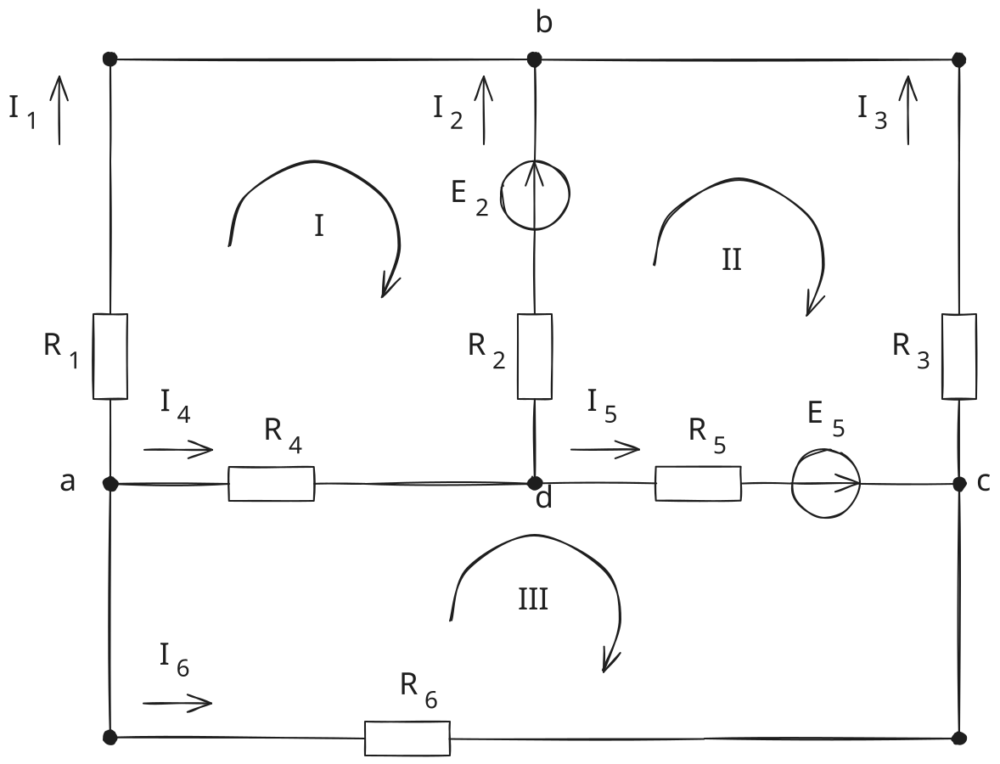
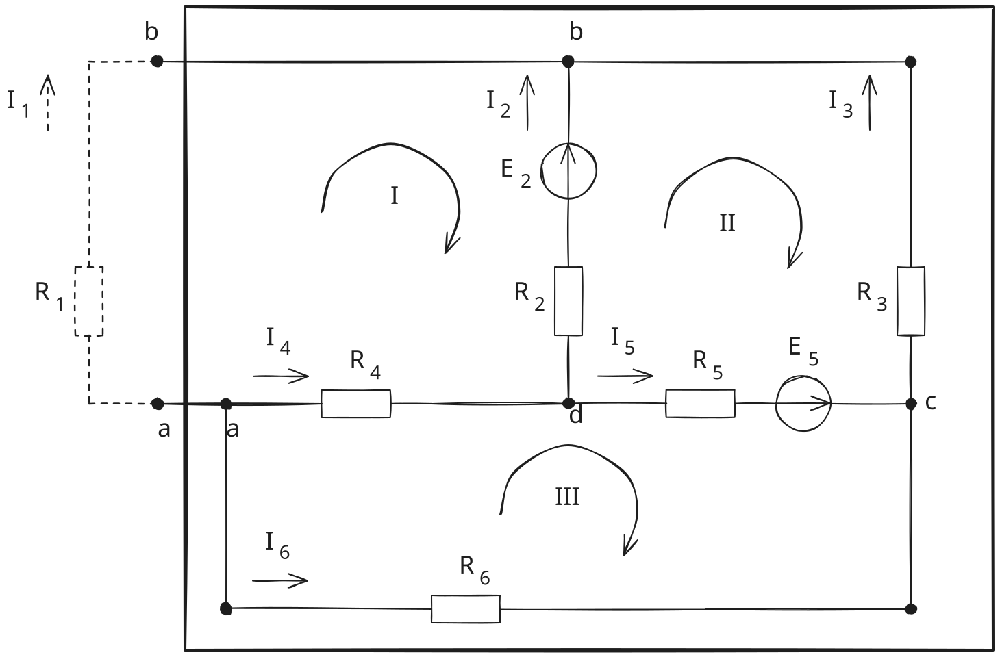
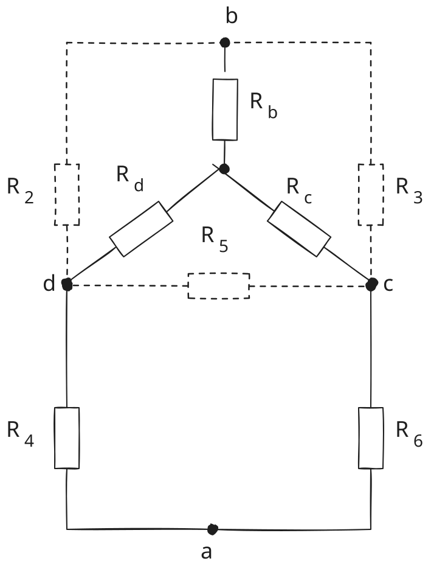

> Вариант 5

- $R_1 = 17 \, Ом$
- $R_2 = 28 \, Ом$
- $R_3 = 43 \, Ом$
- $R_4 = 7 \, Ом$
- $R_5 = 38 \, Ом$
- $R_6 = 30 \, Ом$


- $E_2 = 27 \, В$
- $E_5 = 8 \, В$



# 1 По законам кирхгофа

Ветви:
1. $ab$ ($R_1$)
2. $db$ ($R_2$, $E_2$)
3. $bc$ ($R_3$)
4. $ad$ ($R_4$)
5. $dc$ ($R_5$, $E_5$)
6. $ac$ ($R_6$)

6 токов, 6 уравнений, 6 неизвестных

4 узла: $a$, $b$, $c$, $d$

по 1 закону: $4-1=3$ уравнения

по 2 закону: $6-3=3$ уравнения

пусть $d$ - нулевой потенциал

> 1 закон: алгебраическая сумма токов в узле равна нулю

- a: $-I_1 -I_4 -I_6 = 0$
- b: $+I_1 +I_2 +I_3 = 0$
- c: $-I_3 +I_5 +I_6 = 0$

контуры:
- $abda$ ($R_1$, $E_2$, $R_2$, $R_4$)
- $dbcd$ ($R_2$, $E_2$, $R_3$, $E_5$, $R_5$)
- $adca$ ($R_4$, $R_5$, $E_5$, $R_6$)

> 2 закон: алгебраическая сумма напряжений (U)
> на элементах контура (_в нашем случае: резисторы_)
> равна алгебраической сумме ЭДС

- $+I_1 R_1 -I_2 R_2 -I_4 R_4 = -E2$
- $+I_2 R_2 -I_3 R_3 -I_5 R_5 = +E2 -E5$
- $+I_4 R_4 +I_5 R_5 -I_6 R_6 = +E5$

получили 6 уравнений

матрица:

```
-1   0   0 -1   0  -1 | 0
+1  +1  +1  0   0   0 | 0
 0   0  -1  0  +1  +1 | 0
17 -28   0 -7   0   0 | -27
 0 +28 -43  0 -38   0 | +27-8
 0   0   0 +7 +38 -30 | +8
```

- $I_1 = -122167/270975 \, А$
- $I_2 = +9922/18065 \, А$
- $I_3 = -26663/270975 \, А$
- $I_4 = +153178/270975 \, А$
- $I_5 = +4348/270975 \, А$
- $I_6 = -10337/90325 \, А$


- $I_1 \approx −0.450842329 \, А$
- $I_2 \approx +0.54923886 \, А$
- $I_3 \approx −0.098396531 \, А$
- $I_4 \approx +0.56528462 \, А$
- $I_5 \approx +0.016045761 \, А$
- $I_6 \approx −0.114442292 \, А$

## уравнение баланса мощностей

$$\sum _{i=1} ^n I_i^2 R_i = \sum _{j=1} ^m \pm E_j I_j$$

$$0.203258805 \cdot 17 +$$

$$ +0.301663325 \cdot 28 +$$

$$ +0.009681877 \cdot 43 +$$

$$ +0.319546702 \cdot 7 +$$

$$ +0.000257466 \cdot 38 +$$

$$ +0.013097038 \cdot 30 =$$

$$=14.957815258 \, (Вт)$$

---

$$0.54923886 * 27 + 0.016045761 * 8 = 14.957815308 \, (Вт)$$

> баланс мощностей соблюден: разница $< 10^{-4}$

# 2 Метод контурных токов

контуры:
- $abda$ ($R_1$, $E_2$, $R_2$, $R_4$) - ток $I_{11}$
- $dbcd$ ($R_2$, $E_2$, $R_3$, $E_5$, $R_5$) - ток $I_{22}$
- $adca$ ($R_4$, $R_5$, $E_5$, $R_6$) - ток $I_{33}$

пользуемся 2 законом Кирхгофа

контурные сопротивления:

- $R_{11} = R_1 + R_2 + R_4 = 17 + 28 + 7 = 52 \, (Ом)$
- $R_{22} = R_2 + R_3 + R_5 = 28 + 43 + 38 = 109 \, (Ом)$
- $R_{33} = R_4 + R_5 + R_6 = 7 + 38 + 30 = 75 \, (Ом)$

---

- $I_{11} R_{11} - I_{22} R_2 - I_{33} R_4 = -E_2$
- $I_{22} R_{22} - I_{11} R_2 - I_{33} R_5 = E_2 - E_5$
- $I_{33} R_{33} - I_{11} R_4 - I_{22} R_5 = R_5$

---

- $52 I_{11} - 28 I_{22} - 7 I_{33} = -27 \, А$
- $109 I_{22} - 28 I_{11} - 38 I_{33} = 27 - 8 \, А$
- $75 I_{33} - 7 I_{11} - 38 I_{22} = 8 \, А$

---

- $52 I_{11} - 28 I_{22} - 7 I_{33} = -27 \, А$
- $-28 I_{11} + 109 I_{22} - 38 I_{33} = 19 \, А$
- $-7 I_{11} - 38 I_{22} +75 I_{33} = 8 \, А$

---

- $I_{11} = -122167 / 270975 \, А$
- $I_{22} = 26663 / 270975 \, А$
- $I_{33} = 10337 / 90325 \, А$

---

по ветвям в контурах:

- $I_1 = I_{11} \approx −0.450842329 \, (А) \, (А)$
- $I_2 = -I_{11} + I_{22} \approx 0.450842329 + 0.098396531 = 0.54923886 \, (А)$
- $I_3 = -I_{22} \approx -0.098396531 \, (А)$
- $I_4 = -I_{11} + I_{33} \approx 0.450842329 + 0.114442292 = 0.565284621 \, (А)$
- $I_5 = -I_{22} + I_{33} \approx -0.098396531 + 0.114442292 = 0.016045761 \, (А)$
- $I_6 = -I_{33} \approx -0.114442292 \, (А)$

полученные значения токов совпадают (разница $< 10^{-6}$)

# 3 Метод узловых потенциалов

узлы: $a, b, c, d$

возьмем $d$ как нулевой

проводимости ветвей:

- $G_1 = 1/17 \, См$
- $G_2 = 1/28 \, См$
- $G_3 = 1/43 \, См$
- $G_4 = 1/7 \, См$
- $G_5 = 1/38 \, См$
- $G_6 = 1/30 \, См$

проводимости узлов:

- $G_a = G1 + G4 + G6 \approx 0.235014006 \, См$
- $G_b = G1 + G2 + G3 \approx 0.117793629 \, См$
- $G_c = G3 + G5 + G6 \approx 0.082904937 \, См$

---

- $\varphi_a G_a - \varphi_b G_1 - \varphi_c G_6 - 0 = 0$
- $\varphi_b G_b - \varphi_a G_1 - \varphi_c G_3 - 0 = E_2 G_2$
- $\varphi_c G_c - \varphi_a G_6 - \varphi_b G_3 - 0 = E_5 G_5$

---

- $0.235014006 \cdot \varphi_a - \frac{1}{17} \varphi_b - \frac{1}{30} \varphi_c = 0 \, (А)$
- $0.117793629 \cdot \varphi_b - \frac{1}{17} \varphi_a - \frac{1}{43} \varphi_c = \frac{27}{28} \, (А)$
- $0.082904937 \cdot \varphi_c - \frac{1}{30} \varphi_a - \frac{1}{43} \varphi_b = \frac{8}{38} \, (А)$

---

- $0.235014006 \cdot \varphi_a - \frac{1}{17} \varphi_b - \frac{1}{30} \varphi_c = 0 \, (А)$
- $- \frac{1}{17} \varphi_a + 0.117793629 \cdot \varphi_b - \frac{1}{43} \varphi_c = \frac{27}{28} \, (А)$
- $- \frac{1}{30} \varphi_a - \frac{1}{43} \varphi_b + 0.082904937 \cdot \varphi_c = \frac{8}{38} \, (А)$


<!--
- $+0.235014006 phi_a -1/17 phi_b -1/30 phi_c = 0$
- $-1/17 phi_a +0.117793629 phi_b -1/43 phi_c = 27 / 28$
- $-1/30 phi_a -1/43 phi_b +0.082904937 phi_c = 8 / 38$
-->

---

- $\varphi_a \approx 3.956992331$
- $\varphi_b \approx 11.621311926$
- $\varphi_c \approx 7.390261067$

$$I_i = \frac{\varphi_в - \varphi_н}{R_i}$$

- $I_1 = (\varphi_a - \varphi_b) / R_1$
- $I_2 = (\varphi_d - \varphi_b + E_2) / R_2$
- $I_3 = (\varphi_c - \varphi_b) / R_3$
- $I_4 = (\varphi_a - \varphi_d) / R_4$
- $I_5 = (\varphi_d - \varphi_c + E_5) / R_5$
- $I_6 = (\varphi_a - \varphi_c) / R_6$

---

- $I_1 = (3.956992331 - 11.621311926) / 17 = −0.450842329$
- $I_2 = (0 - 11.621311926 + 27) / 28 = 0.54923886$
- $I_3 = (7.390261067 - 11.621311926) / 43 = −0.098396532$
- $I_4 = (3.956992331 - 0) / 7 = 0.565284619$
- $I_5 = (0 - 7.390261067 + 8) / 38 = 0.016045761$
- $I_6 = (3.956992331 - 7.390261067) / 30 = −0.114442291$

# 4 Сравение методов

| метод          | I1           | I2         | I3           | I4          | I5          | I6           |
|----------------|--------------|------------|--------------|-------------|-------------|--------------|
| законы         | −0.450842329 | 0.54923886 | −0.098396531 | 0.56528462  | 0.016045761 | −0.114442292 |
| конт. токи     | −0.450842329 | 0.54923886 | -0.098396531 | 0.565284621 | 0.016045761 | -0.114442292 |
| уз. потенциалы | −0.450842329 | 0.54923886 | −0.098396532 | 0.565284619 | 0.016045761 | −0.114442291 |
| экв. ген.      | −0.450842329 | -          | -            | -           | -           | -            |

# 5 Эквивалентный генератор



## внутреннее сопротивление генератора

преобразование _треугольник-звезда_



- $R_b = (R_2 \cdot R_3) / (R_2 + R_3 + R_5)$
- $R_c = (R_3 \cdot R_5) / (R_2 + R_3 + R_5)$
- $R_d = (R_2 \cdot R_5) / (R_2 + R_3 + R_5)$

---

$R_2 + R_3 + R_5 = 28 + 43 + 38 = 109$

- $R_b = (28 \cdot 43) / 109 = 1204 / 109 \approx 11.04587156 \, (Ом)$
- $R_c = (43 \cdot 38) / 109 = 1634 / 109 \approx 14.990825688 \, (Ом)$
- $R_d = (28 \cdot 38) / 109 = 1064 / 109 \approx 9.76146789 \, (Ом)$

---

- $R_{d4} = R_d + R_4 = 9.76146789 + 7 = 16.76146789 \, (Ом)$
- $R_{c6} = R_c + R_6 = 14.990825688 + 30 = 44.990825688 \, (Ом)$

$R_{d4c6} = (R_{d4} \cdot R_{c6}) / (R_{d4} + R_{c6}) = 12.211891031 \, (Ом)$

> $R_{вн} = R_{ab} = R_b + R_{d4c6} = 23.257762591 \, Ом$

---

- $R_a = (R_4 \cdot R_6) / ( R_4 + R_5 + R_6 )$
- $R_c = (R_5 \cdot R_6) / ( R_4 + R_5 + R_6 )$
- $R_d = (R_4 \cdot R_5) / ( R_4 + R_5 + R_6 )$


- $R_4 + R_5 + R_6 = 7 + 38 + 30 = 75 \, (Ом)$


- $R_a = (7 \cdot 30) / 75 = 2.8 \, (Ом)$
- $R_c = (38 \cdot 30) / 75 = 15.2 \, (Ом)$
- $R_d = (7 \cdot 38) / 75 = 3.546666667 \, (Ом)$


$R_{c3} = R_c + R_3 = 15.2 + 43 = 58.2 \, (Ом)$

$R_{d2} = R_d + R_2 = 3.546666667 + 28 = 31.546666667 \, (Ом)$

$R_{c3d2} = \frac{R_{c3} \cdot R_{d2}}{R_{c3} + R_{d2}}$

$\approx \frac{1836.016000019}{89.746666667} \approx 20.457762591 \, (Ом)$

> $R_{вн} = R_{c3d2} + R_a = 23.257762591 \, (Ом)$

## вспомогательные токи для вычисления ЭДС генератора


[//]: # (ищем вспомогательные токи Ia, Ib методом двух узлов и контурных токов)

### метод узловых потенциалов

(эквивалентен методу двух узлов)

снова возьмем узел $d$ как нулевой

- $R_{46} = R_4 + R_6$
- $R_{5} = R_5$
- $R_{23} = R_2 + R_3$


- $G_{46} = 1/R_{46}$
- $G_{5} = 1/R_{5}$
- $G_{23} = 1/R_{23}$

узловая проводимость:

$$G_c = G_{46} + G_5 + G_{23}$$

---

$$\varphi_c G_c - 0 = E_2 G_{23} + E_5 G_5$$

узловой потенциал:

$$\varphi_c = \frac{E_2 G_{23} + E_5 G_5}{G_c}$$

$$\varphi_c = \frac{ 27 \, В \cdot 0.014084 \, См + 8 \, В \cdot 0.026315 \, См }{ 0.067427 \, См }$$

$$I_a = I_{46} = \frac{ \varphi_c - \varphi_d }{ R_{46} }$$

$$I_b = I_{23} = \frac{ \varphi_d - \varphi_c }{ R_{23} }$$

---

> $$I_a \approx 0.236814 \, А$$
> 
> $$I_b \approx 0.256871 \, А$$

### метод контурных токов


контуры:
- $adca$
- $bcdb$

контурные сопротивления:

- $R_{11} = R_4 + R_5 + R_6$
- $R_{22} = R_2 + R_3 + R_5$

---

- $I_{11} R_{11} - I_{22} R_5 = +E_5$
- $I_{22} R_{22} - I_{11} R_5 = -E_5 + E_2$

---

- $I_{11} (R_4 + R_5 + R_6) - I_{22} R_5 = +E_5$
- $I_{22} (R_2 + R_3 + R_5) - I_{11} R_5 = -E_5 + E_2$

---

- $I_{11} (7 + 38 + 30) - 38 I_{22} = 8$
- $-38 I_{11} + I_{22} (28 + 43 + 38) = -8 +27$


- $75 I_{11} - 38 I_{22} = +8$
- $-38 I_{11} + 109 I_{22} = +19$


> - $I_a = I_{11} \approx 0.2368147 \, А$
> - $I_b = I_{22} \approx 0.2568712 \, А$

## ЭДС генератора

по контуру abda:

$$E_{вн} = U_{хх} = U_{ab} = R_2 I_b + R_4 I_a -E_2$$

> $$\approx -18.1499034318823 \, В$$

## ток в ветви по закону Ома

$$I_1 = \frac{E_{вн}}{R_1 + R_{вн}}$$

$$I_1 = \frac{-18.1499034318823 \, В}{17 \, Ом + 23.257762591 \, Ом}$$

> $$I_1 \approx −0.450842329 \, А$$

результат совпадает с остальными методами

# 6 Потенциальная диаграмма

возьмем контур dbcd: он включает обе ЭДС (E2, E5)

$$\varphi_d = 0 \, В$$

$$\varphi_{m} = \varphi_d - I_2 \cdot R_2$$

$$\varphi_{m} = - 0.54923886 \cdot 28 \approx −15.37868808 \, (В)$$

$$\varphi_b = \varphi_m + E_2$$

$$\varphi_b = −15.37868808 + 27 = 11.62131192 \, (В)$$

$$\varphi_c = \varphi_b + I_3 \cdot R_3$$

$$\varphi_c = 11.62131192 \, В - 0.098396531 \,А \cdot 43 \,Ом = 7.390261087 \,В$$

$$\varphi_n = \varphi_c - E_5$$

$$\varphi_n = 7.390261087 \,В - 8 \,В = −0.609738913 \,В$$

$$\varphi_d = \varphi_n + I_5 \cdot R_5$$

$$\varphi_d = −0.609738913 \,В + 0.016045761 \,А * 38 \,Ом \approx 0 \,В$$

| точка | R, Ом | $\varphi$, В |
|-------|-------|--------------|
| d     | 0     | 0            |
| m     | 28    | -15.37868808 | 
| b     | 28    | 11.62131192  |
| c     | 71    | 7.390261087  |
| n     | 71    | -0.609738913 |
| d     | 79    | 0            |

