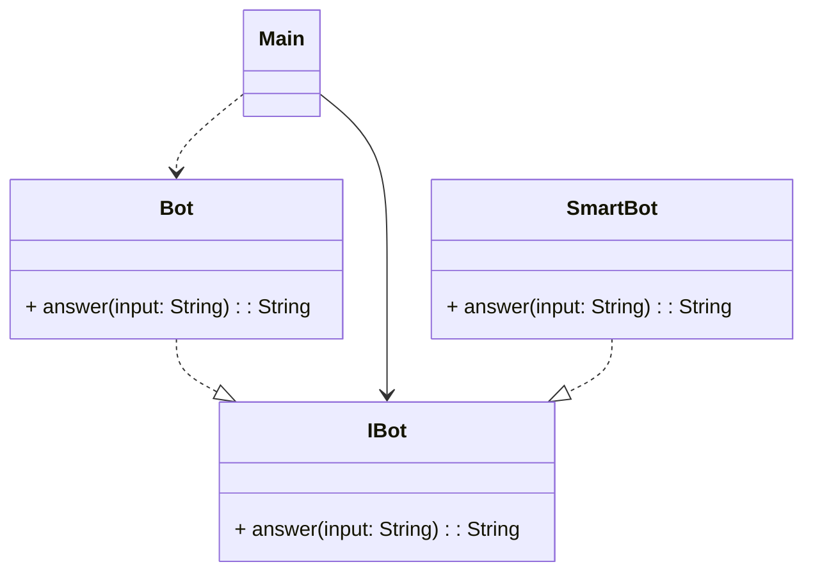

- Entities (Model)
- Use cases (also)
- Controllers, Gateways (API), Presenters
- View
  - web
  - ui
  - db

JavaFX, RegEx, MVC, отношения классов
- наследование: `child --|> parent`
  - реализация: `impl - - -|> iface`
- композиция:   `part --<*> whole`
- агрегация:    `part --<> whole`
- ассоциация:
  - `secondary <-- main`
  - `secondary -- main`
  - `secondary <--> main`
- зависимость
  - когда приходится менять другой класс
  - `dep <- - - main`

Regex
- метасимволы
  - `.` - любой символ
  - `\d` - любая цифра
  - `\D` - любая НЕ цифра
  - `[]` - символ из множества
- _квантификаторы_
  - `*` - 0+ повтрений
  - `+` - 1+ повтрений
  - `?` - 0-1 символ
  - `{n}` - ровно n повторений
  - `{n,m}`: n-m повторений (включительно)

```
/[А-ЯЁ][а-яё]*\s+[А-ЯЁ][а-яё]*/
/[А-ЯЁ][а-яё]{2,}/
```

- `^` - началало строки
- `$` - конец

- `^.+$` - ищет каждую строку ненулевой длины
- `\b` - граница слова

- `(смарт|теле)фон`

plantuml умеет визуалить реги!

`java.util.regex`

- `Pattern` - сама регулярка
- `Matcher`
- `PatternSyntaxException`

`String.matches`

в питоне: `r"\d"`

factory method `Pattern.compile`

`pattern.matcher(String) -> Matcher`

`matcher.find() -> boolean` - mutates

`matcher.group() -> String`

```java
List email = new ArrayList();  // List - iface
// ArrayList - impl. Динамический массив короче

String regex = "^[A-Za-z0-9+_.-]+@(.+)$";
```
TDD (test-driven development)

заготовки которые заведомо падают

- делаем заготовки для функций, классов (интерфеисы, прототипы)
- `<- - запуск - ->`
- делаем тесты
- пишем функции, классы целиком
- `<- исправить код ->`
- запуск тестов



- словарь ("вопрос", "ответ") O(1) в среднем?
- словарь ("команда", фция) O(1) в среднем?
- массивВопросов + массивОтветов (но тут поиск медленный! словарь лучше)
- массивРегулярок + массивОтветов
- массивПар: Regex, ответ
- массивПар: Regex, обработчик
- `IAnswer[]`

```java
interface IAnswer {
    boolean isSuitable(String input);
    String answer(String input);
}
```