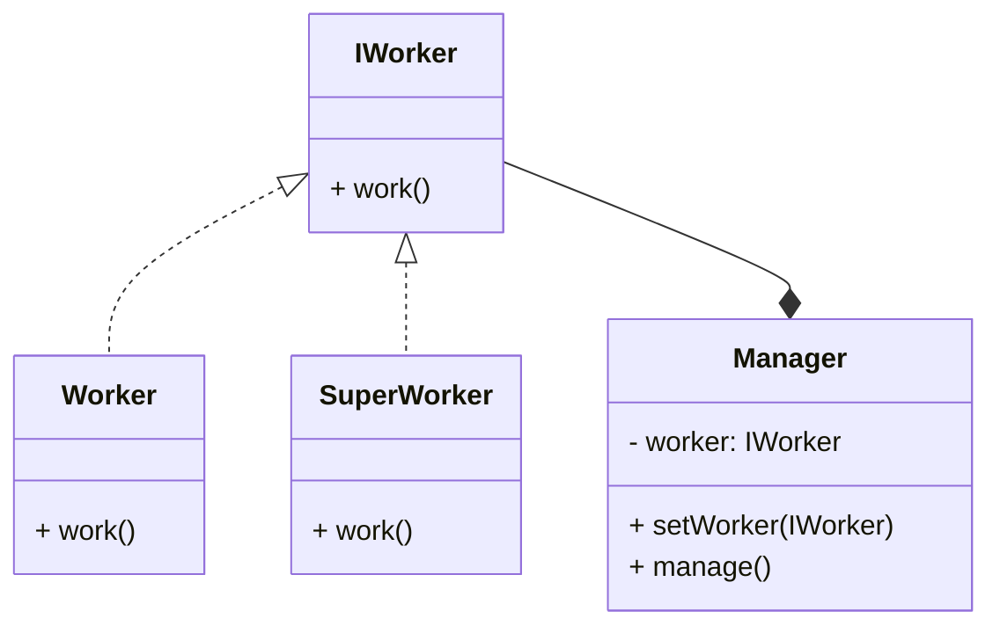

# SOLID

Это принципы OOP

- свойство массовости
- Don't Repeat Yourself (DRY)
- модульность
  - процедурно-модульная парадигма

- Keep It Simple
- единая ответственность (SRP)

## Single Responsibility Principle

## Open/Closed

> открыто для расширения, закрыто для изменения

хирургия и шляпа

Классы, модули, функции, ... должны быть открыты для расширения,
но закрыты для изменения

Не меняем классы, делаем наследование

напр.

```pascal
type TForm1 = class(TForm)
```

Реализуется через: наследование

## Liskov Substitution

see Duck Typing

Если наследуем, надо чтоб поведение соответствовало

То есть надо чтобы производный класс можно было спокойно скормить функции от родительского класса

Реализуется через: динамический полиморфизм

```c++
void print_collection_size( OrderedCollection col );
```

## Interface Segregation

Eat + Drink

> Клиенты не должны зависеть от методов, которые они не используют

напр. МФУ и простой принтер

вот так лучше:

```csharp
class Printer : IPrinter
{
    void Print()
    {
        Todo();
    }
}

class AllInOneDevice : IPrinter, IFax, IScanner
{
    void Print() { Todo(); }
    void Fax() { Todo(); }
    void Scan() { Todo(); }
}
```

## Dependency inversion

пользуемся API а не низкоуровневыми вызовами.

> Модули верхнего уровня (_пользователи_, _клиенты_) не должны зависеть от модулей нижних уровней.
> Оба типа модулей должны зависеть от абстракций

> Абстракции (_интерфейсы_) не должны зависеть от деталей.
> Детали должны зависеть от абстракций.

кароче они должны взаимодействовать с интерфейсом, а не конкретным классом



```java
IWorker w1 = new Worker();
IWorker w2 = new SuperWorker();

var m = new Manager();
m.setWorker(w1);
m.setWorker(w2);

m.manage();
```

### Dependency injection

внедрение зависимостей

TODO

### C4-диаграммы

#### Системы (уровень контекста)

отдельные наборы программ

#### Контейнеров

отдельная прога

#### Компонентов

большая часть программы

напр. M, V, C

#### Кода

грубо говоря UML

но это нам не задают
