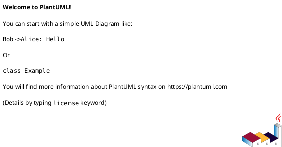
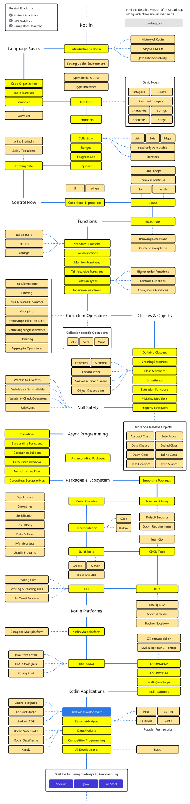

# Язык программирования

<>

TODO:
- [x] roadmap
- [x] шаблоны
  - [x] GUI
  - [x] CLI
- [x] GUI frameworks
- [x] как объявить класс
- ..?

---

- Название: Kotlin
- Назначение: общее (не специфично)
- Парадигмы:
  - процедурное
      - ООП
  - функциональное программирование (предпочтительное)
- Управление памятью: сборщик мусора (на всех платформах)
- Система типов:
  - Статическая
    - с динамическим полиморфизмом по умолчанию
      - через класс `Any` (`Object` в JVM)
  - Строгая
    - Как в Java
  - Исключително ссылочная
    - На JVM классы-обертки преобразуются в примитивные типы, когда возможно
  - Null-безопасность
    - `null` нельзя присвоить типу, если не обьявить его опциональность (напр. `Int?`)
- Платформы:
  - JVM (основная)
  - JS
  - Native
- Графические фреймворки
  - JavaFX - доступно на JVM
  - TornadoFX (устарел) - надстройка над JavaFX
  - Jetpack Compose - современный, декларативный, от JetBrains

# Примеры кода

## hello-world в одном файле

```kotlin
// функция вне класса - на JVM преобразуется в статический метод
fun main() {
    println("Hello, World!")
}
```

```kotlin
// функция из единственного выражения
fun main() = println("Hello, World!")
```

```kotlin
// если это скрипт с расширением `.kts`
println("Hello, World!")
```

```kotlin
/** Минимальная реализация команды `echo` */
fun main(args: Array<String>) = println(args.joinToString(separator = " "))
```

```kotlin
// Создать "пустой" класс
class Main
```

```kotlin
/**
 * Т.н. алгебраический тип данных:
 * обычный класс с автоматически реализованными методами
 * - `toString()`
 * - `copy()`
 * - `componentN()` (для деструктурирования)
 * 
 * Без слова `data` тоже будет работать.
 */
data class Pair<A, B>(
    /**
     * Первый параметр конструктора
     * (`val`: неизменяемый и с автоматичесим созданием поля)
     */
    val first: A,
    /** Второй параметр */
    val second: B,
) {
    // метод (member)
    fun<T> mapFirst(transform: (A) -> T) = copy(first = transform(first))
}
```

## JavaFX

Может выглядеть так:

```kotlin
import javafx.application.Application
import javafx.fxml.FXMLLoader
import javafx.scene.Scene
import javafx.stage.Stage

class ApplicationImpl: Application {
    override fun start(stage: Stage) {
        val loader = FXMLLoader(
            ApplicationImpl::class.java.getResource("window.fxml")
        )
        
        stage.scene = Scene(loader.load(), 320.0, 240.0)
        stage.show()
    }
}

fun main() = Application.launch(ApplicationImpl::class.java)
```

Более полные шаблоны генерирует IntelliJ IDEA при создании проекта.


# Обзор коллекций

На платформе JVM доступны все коллекции из библиотеки классов Java.

Но обычно они используются не напрямую,
а через интерфейсы или классы в пакете `kotlin.collections`.

Это позволяет использовать коллекции на других платформах: JS и Native.

Экземпляры коллекций обычно создаются при помощи функций:
- `listOf`
- `mutableListOf`
- `setOf`
- `mutableSetOf`
- `mapOf`
- `mutableMapOf`

или при помощи Builder-паттерна внутри лямбда-аргумента функций:
- `buildList`
- `buildSet`
- `buildMap`

упрощенная иерархия:
- `interface Iterable`
  - `interface Collection`
    - `interface List`
      - `interface MutableList`
        - `class ArrayList`



# Roadmap

<https://roadmap.sh/kotlin>

